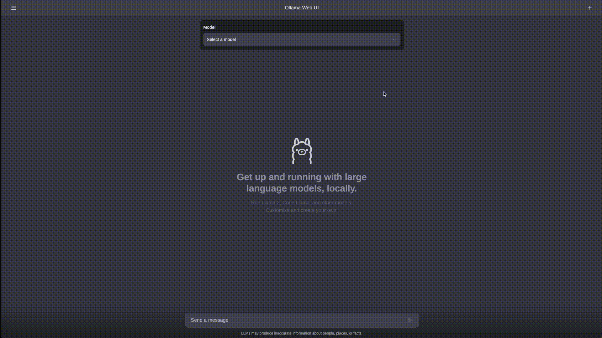

# Ollama Web UI: A User-Friendly Web Interface for Chat Interactions 👋


[](https://discord.gg/5rJgQTnV4s)
[](https://github.com/sponsors/tjbck)

ChatGPT-Style Web Interface for Ollama 🦙

**Disclaimer:** _ollama-webui is a community-driven project and is not affiliated with the Ollama team in any way. This initiative is independent, and any inquiries or feedback should be directed to [our community on Discord](https://discord.gg/5rJgQTnV4s). We kindly request users to refrain from contacting or harassing the Ollama team regarding this project._



Also check our sibling project, [OllamaHub](https://ollamahub.com/), where you can discover, download, and explore customized Modelfiles for Ollama! 🦙🔍

## Features ⭐

- 🖥️ **Intuitive Interface**: Our chat interface takes inspiration from ChatGPT, ensuring a user-friendly experience.

- 📱 **Responsive Design**: Enjoy a seamless experience on both desktop and mobile devices.

- ⚡ **Swift Responsiveness**: Enjoy fast and responsive performance.

- 🚀 **Effortless Setup**: Install seamlessly using Docker or Kubernetes (kubectl, kustomize or helm) for a hassle-free experience.

- 💻 **Code Syntax Highlighting**: Enjoy enhanced code readability with our syntax highlighting feature.

- ✒️🔢 **Full Markdown and LaTeX Support**: Elevate your LLM experience with comprehensive Markdown and LaTeX capabilities for enriched interaction.

- 📚 **Local RAG Integration (Alpha)**: Immerse yourself in cutting-edge Retrieval Augmented Generation support, revolutionizing your chat experience by seamlessly incorporating document interactions. In its alpha phase, expect occasional issues as we actively refine and enhance this feature to ensure optimal performance and reliability.

- 📜 **Prompt Preset Support**: Instantly access preset prompts using the '/' command in the chat input. Load predefined conversation starters effortlessly and expedite your interactions. Effortlessly import prompts through [OllamaHub](https://ollamahub.com/) integration.

- 👍👎 **RLHF Annotation**: Empower your messages by rating them with thumbs up and thumbs down, facilitating the creation of datasets for Reinforcement Learning from Human Feedback (RLHF). Utilize your messages to train or fine-tune models, all while ensuring the confidentiality of locally saved data.

- 📥🗑️ **Download/Delete Models**: Easily download or remove models directly from the web UI.

- ⬆️ **GGUF File Model Creation**: Effortlessly create Ollama models by uploading GGUF files directly from the web UI. Streamlined process with options to upload from your machine or download GGUF files from Hugging Face.

- 🤖 **Multiple Model Support**: Seamlessly switch between different chat models for diverse interactions.

- 🔄 **Multi-Modal Support**: Seamlessly engage with models that support multimodal interactions, including images (e.g., LLava).

- 🧩 **Modelfile Builder**: Easily create Ollama modelfiles via the web UI. Create and add characters/agents, customize chat elements, and import modelfiles effortlessly through [OllamaHub](https://ollamahub.com/) integration.

- ⚙️ **Many Models Conversations**: Effortlessly engage with various models simultaneously, harnessing their unique strengths for optimal responses. Enhance your experience by leveraging a diverse set of models in parallel.

- 🤝 **OpenAI API Integration**: Effortlessly integrate OpenAI-compatible API for versatile conversations alongside Ollama models. Customize the API Base URL to link with **LMStudio, Mistral, OpenRouter, and more**.

- 🔄 **Regeneration History Access**: Easily revisit and explore your entire regeneration history.

- 📜 **Chat History**: Effortlessly access and manage your conversation history.

- 📤📥 **Import/Export Chat History**: Seamlessly move your chat data in and out of the platform.

- 🗣️ **Voice Input Support**: Engage with your model through voice interactions; enjoy the convenience of talking to your model directly. Additionally, explore the option for sending voice input automatically after 3 seconds of silence for a streamlined experience.

- ⚙️ **Fine-Tuned Control with Advanced Parameters**: Gain a deeper level of control by adjusting parameters such as temperature and defining your system prompts to tailor the conversation to your specific preferences and needs.

- 🔗 **External Ollama Server Connection**: Seamlessly link to an external Ollama server hosted on a different address by configuring the environment variable.

- 🔐 **Role-Based Access Control (RBAC)**: Ensure secure access with restricted permissions; only authorized individuals can access your Ollama, and exclusive model creation/pulling rights are reserved for administrators.

- 🔒 **Backend Reverse Proxy Support**: Bolster security through direct communication between Ollama Web UI backend and Ollama. This key feature eliminates the need to expose Ollama over LAN. Requests made to the '/ollama/api' route from the web UI are seamlessly redirected to Ollama from the backend, enhancing overall system security.

- 🌟 **Continuous Updates**: We are committed to improving Ollama Web UI with regular updates and new features.

## 🔗 Also Check Out OllamaHub!

Don't forget to explore our sibling project, [OllamaHub](https://ollamahub.com/), where you can discover, download, and explore customized Modelfiles. OllamaHub offers a wide range of exciting possibilities for enhancing your chat interactions with Ollama! 🚀

## How to Install 🚀

🌟 **Important Note on User Roles and Privacy:**

- **Admin Creation:** The very first account to sign up on the Ollama Web UI will be granted **Administrator privileges**. This account will have comprehensive control over the platform, including user management and system settings.

- **User Registrations:** All subsequent users signing up will initially have their accounts set to **Pending** status by default. These accounts will require approval from the Administrator to gain access to the platform functionalities.

- **Privacy and Data Security:** We prioritize your privacy and data security above all. Please be reassured that all data entered into the Ollama Web UI is stored locally on your device. Our system is designed to be privacy-first, ensuring that no external requests are made, and your data does not leave your local environment. We are committed to maintaining the highest standards of data privacy and security, ensuring that your information remains confidential and under your control.

### Installing Ollama Web UI Only

#### Prerequisites

Make sure you have the latest version of Ollama installed before proceeding with the installation. You can find the latest version of Ollama at [https://ollama.ai/](https://ollama.ai/).

##### Checking Ollama

After installing Ollama, verify that Ollama is running by accessing the following link in your web browser: [http://127.0.0.1:11434/](http://127.0.0.1:11434/). Note that the port number may differ based on your system configuration.

#### Using Docker 🐳

**Important:** When using Docker to install Ollama Web UI, make sure to include the `-v ollama-webui:/app/backend/data` in your Docker command. This step is crucial as it ensures your database is properly mounted and prevents any loss of data.

If Ollama is hosted on your local machine and accessible at [http://127.0.0.1:11434/](http://127.0.0.1:11434/), run the following command:

```bash
docker run -d -p 3000:8080 --add-host=host.docker.internal:host-gateway -v ollama-webui:/app/backend/data --name ollama-webui --restart always ghcr.io/ollama-webui/ollama-webui:main
```

Alternatively, if you prefer to build the container yourself, use the following command:

```bash
docker build -t ollama-webui .
docker run -d -p 3000:8080 --add-host=host.docker.internal:host-gateway -v ollama-webui:/app/backend/data --name ollama-webui --restart always ollama-webui
```

Your Ollama Web UI should now be hosted at [http://localhost:3000](http://localhost:3000) and accessible over LAN (or Network). Enjoy! 😄

#### Accessing External Ollama on a Different Server

Change `OLLAMA_API_BASE_URL` environment variable to match the external Ollama Server url:

```bash
docker run -d -p 3000:8080 -e OLLAMA_API_BASE_URL=https://example.com/api -v ollama-webui:/app/backend/data --name ollama-webui --restart always ghcr.io/ollama-webui/ollama-webui:main
```

Alternatively, if you prefer to build the container yourself, use the following command:

```bash
docker build -t ollama-webui .
docker run -d -p 3000:8080 -e OLLAMA_API_BASE_URL=https://example.com/api -v ollama-webui:/app/backend/data --name ollama-webui --restart always ollama-webui
```

### Installing Both Ollama and Ollama Web UI

#### Using Docker Compose

If you don't have Ollama installed yet, you can use the provided Docker Compose file for a hassle-free installation. Simply run the following command:

```bash
docker compose up -d --build
```

This command will install both Ollama and Ollama Web UI on your system.

##### Enable GPU

Use the additional Docker Compose file designed to enable GPU support by running the following command:

```bash
docker compose -f docker-compose.yaml -f docker-compose.gpu.yaml up -d --build
```

##### Expose Ollama API outside the container stack

Deploy the service with an additional Docker Compose file designed for API exposure:

```bash
docker compose -f docker-compose.yaml -f docker-compose.api.yaml up -d --build
```

#### Using Provided `run-compose.sh` Script (Linux)

Also available on Windows under any docker-enabled WSL2 linux distro (you have to enable it from Docker Desktop)

Simply run the following command to grant execute permission to script:

```bash
chmod +x run-compose.sh
```

##### For CPU only container

```bash
./run-compose.sh
```

##### Enable GPU

For GPU enabled container (to enable this you must have your gpu driver for docker, it mostly works with nvidia so this is the official install guide: [nvidia-container-toolkit](https://docs.nvidia.com/datacenter/cloud-native/container-toolkit/latest/install-guide.html))
Warning! A GPU-enabled installation has only been tested using linux and nvidia GPU, full functionalities are not guaranteed under Windows or Macos or using a different GPU

```bash
./run-compose.sh --enable-gpu
```

Note that both the above commands will use the latest production docker image in repository, to be able to build the latest local version you'll need to append the `--build` parameter, for example:

```bash
./run-compose.sh --enable-gpu --build
```

#### Using Alternative Methods (Kustomize or Helm)

See [INSTALLATION.md](/INSTALLATION.md) for information on how to install and/or join our [Ollama Web UI Discord community](https://discord.gg/5rJgQTnV4s).

## How to Install Without Docker

While we strongly recommend using our convenient Docker container installation for optimal support, we understand that some situations may require a non-Docker setup, especially for development purposes. Please note that non-Docker installations are not officially supported, and you might need to troubleshoot on your own.

### Project Components

The Ollama Web UI consists of two primary components: the frontend and the backend (which serves as a reverse proxy, handling static frontend files, and additional features). Both need to be running concurrently for the development environment.

> [!IMPORTANT]
> The backend is required for proper functionality

### Requirements 📦

- 🐰 [Bun](https://bun.sh) >= 1.0.21 or 🐢 [Node.js](https://nodejs.org/en) >= 20.10
- 🐍 [Python](https://python.org) >= 3.11

### Build and Install 🛠️

Run the following commands to install:

```sh
git clone https://github.com/ollama-webui/ollama-webui.git
cd ollama-webui/

# Copying required .env file
cp -RPp example.env .env

# Building Frontend Using Node
npm i
npm run build

# or Building Frontend Using Bun
# bun install
# bun run build

# Serving Frontend with the Backend
cd ./backend
pip install -r requirements.txt -U
sh start.sh
```

You should have the Ollama Web UI up and running at http://localhost:8080/. Enjoy! 😄

## Troubleshooting

See [TROUBLESHOOTING.md](/TROUBLESHOOTING.md) for information on how to troubleshoot and/or join our [Ollama Web UI Discord community](https://discord.gg/5rJgQTnV4s).

## What's Next? 🚀

### Roadmap 📝

Here are some exciting tasks on our roadmap:

- 🌐 **Web Browsing Capability**: Experience the convenience of seamlessly integrating web content directly into your chat. Easily browse and share information without leaving the conversation.
- 🔄 **Function Calling**: Empower your interactions by running code directly within the chat. Execute functions and commands effortlessly, enhancing the functionality of your conversations.
- ⚙️ **Custom Python Backend Actions**: Empower your Ollama Web UI by creating or downloading custom Python backend actions. Unleash the full potential of your web interface with tailored actions that suit your specific needs, enhancing functionality and versatility.
- 🧠 **Long-Term Memory**: Witness the power of persistent memory in our agents. Enjoy conversations that feel continuous as agents remember and reference past interactions, creating a more cohesive and personalized user experience.
- 🧪 **Research-Centric Features**: Empower researchers in the fields of LLM and HCI with a comprehensive web UI for conducting user studies. Stay tuned for ongoing feature enhancements (e.g., surveys, analytics, and participant tracking) to facilitate their research.
- 📈 **User Study Tools**: Providing specialized tools, like heat maps and behavior tracking modules, to empower researchers in capturing and analyzing user behavior patterns with precision and accuracy.
- 📚 **Enhanced Documentation**: Elevate your setup and customization experience with improved, comprehensive documentation.

Feel free to contribute and help us make Ollama Web UI even better! 🙌

## Supporters ✨

A big shoutout to our amazing supporters who's helping to make this project possible! 🙏

### Platinum Sponsors 🤍

- We're looking for Sponsors!

### Acknowledgments

Special thanks to [Prof. Lawrence Kim @ SFU](https://www.lhkim.com/) and [Prof. Nick Vincent @ SFU](https://www.nickmvincent.com/) for their invaluable support and guidance in shaping this project into a research endeavor. Grateful for your mentorship throughout the journey! 🙌

## License 📜

This project is licensed under the [MIT License](LICENSE) - see the [LICENSE](LICENSE) file for details. 📄

## Support 💬

If you have any questions, suggestions, or need assistance, please open an issue or join our
[Ollama Web UI Discord community](https://discord.gg/5rJgQTnV4s) or
[Ollama Discord community](https://discord.gg/ollama) to connect with us! 🤝

---

Created by [Timothy J. Baek](https://github.com/tjbck) - Let's make Ollama Web UI even more amazing together! 💪
