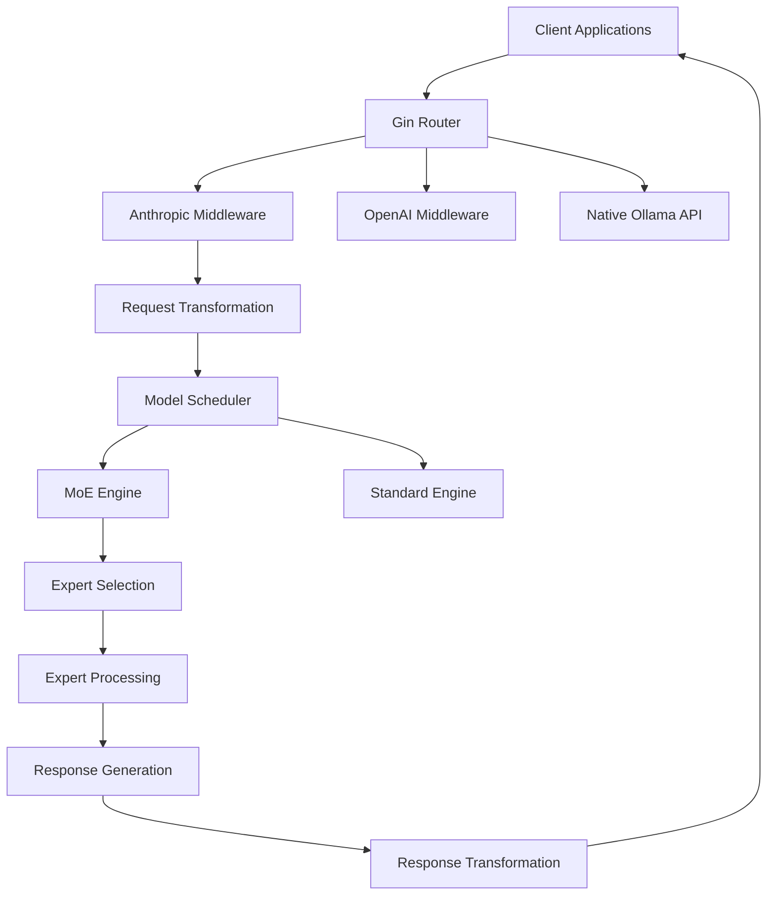

# Technical Architecture: Ollama Server Enhancements

This document provides detailed technical information about the architecture and implementation of the Ollama server enhancements, specifically focusing on the Anthropic API compatibility layer and enhanced MoE support.

## Architecture Overview



## 1. Anthropic API Compatibility Layer

### 1.1 Package Structure

```
anthropic/
├── anthropic.go          # Core implementation
└── anthropic_test.go     # Comprehensive test suite
```

### 1.2 Core Data Structures

#### Message Request Structure
```go
type MessageRequest struct {
    Model         string      `json:"model"`
    MaxTokens     int         `json:"max_tokens"`
    Messages      []Message   `json:"messages"`
    System        string      `json:"system,omitempty"`
    Metadata      interface{} `json:"metadata,omitempty"`
    StopSequences []string    `json:"stop_sequences,omitempty"`
    Stream        bool        `json:"stream,omitempty"`
    Temperature   *float64    `json:"temperature,omitempty"`
    TopP          *float64    `json:"top_p,omitempty"`
    TopK          *int        `json:"top_k,omitempty"`
    Tools         []api.Tool  `json:"tools,omitempty"`
}
```

#### Content Block System
```go
type ContentBlock struct {
    Type  string `json:"type"`
    Text  string `json:"text,omitempty"`
    
    // Tool use fields
    ID    string                 `json:"id,omitempty"`
    Name  string                 `json:"name,omitempty"`
    Input map[string]interface{} `json:"input,omitempty"`
}
```

### 1.3 Request Processing Pipeline

#### Phase 1: Request Validation
```go
func MessagesMiddleware() gin.HandlerFunc {
    return func(c *gin.Context) {
        var req MessageRequest
        err := c.ShouldBindJSON(&req)
        
        // Validation checks
        if len(req.Messages) == 0 {
            c.AbortWithStatusJSON(400, NewError("messages field is required"))
            return
        }
        
        if req.MaxTokens <= 0 {
            c.AbortWithStatusJSON(400, NewError("max_tokens is required"))
            return
        }
        
        // Continue processing...
    }
}
```

#### Phase 2: Message Transformation
```go
func fromAnthropicMessages(messages []Message) ([]api.Message, string, error) {
    var apiMessages []api.Message
    var systemPrompt string
    
    for _, msg := range messages {
        switch msg.Role {
        case "user", "assistant":
            content, images := processContent(msg.Content)
            apiMessages = append(apiMessages, api.Message{
                Role:    msg.Role,
                Content: content,
                Images:  images,
            })
        case "system":
            systemPrompt = msg.Content.(string)
        }
    }
    
    return apiMessages, systemPrompt, nil
}
```

#### Phase 3: Content Processing
```go
func processContent(content interface{}) (string, []api.ImageData) {
    switch c := content.(type) {
    case string:
        return c, nil
    case []interface{}:
        var text string
        var images []api.ImageData
        
        for _, item := range c {
            block := item.(map[string]interface{})
            switch block["type"].(string) {
            case "text":
                text += block["text"].(string)
            case "image":
                img := processImageBlock(block)
                images = append(images, img)
            }
        }
        
        return text, images
    }
}
```

### 1.4 Response Processing Pipeline

#### Phase 1: Response Transformation
```go
func toMessageResponse(id string, r api.ChatResponse) MessageResponse {
    contentBlocks := toContentBlocks(r.Message.Content, r.Message.ToolCalls)
    
    var stopReason *string
    if r.DoneReason != "" {
        reason := mapStopReason(r.DoneReason)
        stopReason = &reason
    }
    
    return MessageResponse{
        ID:         fmt.Sprintf("msg_%s", id),
        Type:       "message",
        Role:       r.Message.Role,
        Content:    contentBlocks,
        Model:      r.Model,
        StopReason: stopReason,
        Usage:      toUsage(r),
    }
}
```

#### Phase 2: Streaming Support
```go
func (w *MessagesWriter) writeResponse(data []byte) (int, error) {
    var chatResponse api.ChatResponse
    json.Unmarshal(data, &chatResponse)

    if w.stream {
        responses := toMessageStreamResponse(w.id, chatResponse, chatResponse.Done)
        
        w.ResponseWriter.Header().Set("Content-Type", "text/event-stream")
        
        for _, resp := range responses {
            d, _ := json.Marshal(resp)
            w.ResponseWriter.Write([]byte(fmt.Sprintf("data: %s\n\n", d)))
        }
        
        if chatResponse.Done {
            w.ResponseWriter.Write([]byte("data: [DONE]\n\n"))
        }
    }
    
    return len(data), nil
}
```

### 1.5 Tool Integration

#### Tool Definition Processing
```go
type ToolDefinition struct {
    Name        string      `json:"name"`
    Description string      `json:"description"`
    InputSchema interface{} `json:"input_schema"`
}

func processTools(tools []ToolDefinition) []api.Tool {
    var apiTools []api.Tool
    
    for _, tool := range tools {
        apiTool := api.Tool{
            Type: "function",
            Function: api.ToolFunction{
                Name:        tool.Name,
                Description: tool.Description,
                Parameters:  convertSchema(tool.InputSchema),
            },
        }
        apiTools = append(apiTools, apiTool)
    }
    
    return apiTools
}
```

#### Tool Call Response Generation
```go
func toContentBlocks(content string, toolCalls []api.ToolCall) []ContentBlock {
    var blocks []ContentBlock
    
    if content != "" {
        blocks = append(blocks, ContentBlock{
            Type: "text",
            Text: content,
        })
    }
    
    for _, tc := range toolCalls {
        blocks = append(blocks, ContentBlock{
            Type:  "tool_use",
            ID:    fmt.Sprintf("toolu_%s", generateID(8)),
            Name:  tc.Function.Name,
            Input: tc.Function.Arguments,
        })
    }
    
    return blocks
}
```

## 2. Enhanced MoE Architecture

### 2.1 Core MoE Components

#### Expert Configuration
```c
// Maximum number of experts supported
#define LLAMA_MAX_EXPERTS 384

// Expert gating function types
enum llama_expert_gating_func_type {
    LLAMA_EXPERT_GATING_FUNC_TYPE_NONE    = 0,
    LLAMA_EXPERT_GATING_FUNC_TYPE_SOFTMAX = 1,
    LLAMA_EXPERT_GATING_FUNC_TYPE_SIGMOID = 2
};
```

#### Model Parameters
```c
struct llama_hparams {
    uint32_t n_expert = 0;           // Total number of experts
    uint32_t n_expert_used = 0;      // Number of experts used per token
    uint32_t n_expert_shared = 0;    // Number of shared experts
    uint32_t expert_gating_func = LLAMA_EXPERT_GATING_FUNC_TYPE_NONE;
    uint32_t moe_every_n_layers = 0; // MoE frequency
    bool     expert_weights_norm = false;
    float    expert_weights_scale = 1.0f;
};
```

### 2.2 Expert Selection Algorithm

#### Top-K Expert Selection
```c
ggml_tensor * build_moe_ffn(
    ggml_tensor * cur,
    ggml_tensor * gate_inp,
    ggml_tensor * up_exps,
    ggml_tensor * gate_exps,
    ggml_tensor * down_exps,
    ggml_tensor * exp_probs_b,
    int64_t       n_expert,
    int64_t       n_expert_used,
    llm_ffn_op_type type_op,
    bool          norm_w,
    bool          scale_w,
    float         w_scale,
    int           il) {
    
    // Compute expert logits
    ggml_tensor * logits = build_lora_mm(gate_inp, cur);
    
    // Apply gating function
    ggml_tensor * probs = nullptr;
    switch (gating_func) {
        case LLAMA_EXPERT_GATING_FUNC_TYPE_SOFTMAX:
            probs = ggml_soft_max(ctx0, logits);
            break;
        case LLAMA_EXPERT_GATING_FUNC_TYPE_SIGMOID:
            probs = ggml_sigmoid(ctx0, logits);
            break;
    }
    
    // Select top-k experts
    ggml_tensor * selected_experts = ggml_top_k(ctx0, probs, n_expert_used);
    
    // Compute expert weights
    ggml_tensor * weights = ggml_get_rows(ctx0,
        ggml_reshape_3d(ctx0, probs, 1, n_expert, n_tokens), 
        selected_experts);
    
    // Normalize weights if required
    if (norm_w) {
        weights = ggml_reshape_2d(ctx0, weights, n_expert_used, n_tokens);
        ggml_tensor * weights_sum = ggml_sum_rows(ctx0, weights);
        weights = ggml_div(ctx0, weights, weights_sum);
        weights = ggml_reshape_3d(ctx0, weights, 1, n_expert_used, n_tokens);
    }
    
    // Process experts
    ggml_tensor * up = build_lora_mm_id(up_exps, cur, selected_experts);
    ggml_tensor * gate = build_lora_mm_id(gate_exps, cur, selected_experts);
    
    // Apply activation function
    switch (type_op) {
        case LLM_FFN_SILU:
            gate = ggml_silu(ctx0, gate);
            break;
        case LLM_FFN_GELU:
            gate = ggml_gelu(ctx0, gate);
            break;
    }
    
    // Combine gate and up projections
    ggml_tensor * experts = ggml_mul(ctx0, gate, up);
    experts = build_lora_mm_id(down_exps, experts, selected_experts);
    
    // Apply weights and aggregate
    if (!weight_before_ffn) {
        experts = ggml_mul(ctx0, experts, weights);
    }
    
    // Aggregate expert outputs
    ggml_tensor * moe_out = nullptr;
    for (int i = 0; i < n_expert_used; ++i) {
        ggml_tensor * cur_expert = ggml_view_2d(ctx0, experts, 
            n_embd, n_tokens, experts->nb[1], i * experts->nb[1]);
        
        if (i == 0) {
            moe_out = cur_expert;
        } else {
            moe_out = ggml_add(ctx0, moe_out, cur_expert);
        }
    }
    
    return ggml_cont(ctx0, moe_out);
}
```

### 2.3 Memory Optimization

#### Dynamic Memory Allocation
```c
// Calculate memory requirements for MoE models
size_t calculate_moe_memory(const llama_hparams & hparams) {
    size_t expert_memory = 0;
    
    if (hparams.n_expert > 0) {
        // Memory for expert weights
        expert_memory += hparams.n_expert * hparams.n_ff * hparams.n_embd * sizeof(float);
        
        // Memory for expert selection
        expert_memory += hparams.n_expert * sizeof(float);
        
        // Memory for intermediate computations
        expert_memory += hparams.n_expert_used * hparams.n_ff * sizeof(float);
    }
    
    return expert_memory;
}
```

#### Quantization Strategy
```c
// Expert-aware quantization
ggml_type get_expert_tensor_type(const llama_model_quantize_params * params,
                                 const std::string & name,
                                 int n_expert) {
    if (n_expert >= 8) {
        // Use higher precision for models with many experts
        if (name.find("ffn_gate_exps") != std::string::npos ||
            name.find("ffn_up_exps") != std::string::npos ||
            name.find("ffn_down_exps") != std::string::npos) {
            return GGML_TYPE_Q5_K;
        }
    }
    
    // Default quantization for other tensors
    return get_default_tensor_type(params, name);
}
```

### 2.4 Performance Optimizations

#### Parallel Expert Processing
```c
// Process multiple experts in parallel
void process_experts_parallel(ggml_tensor * experts,
                             ggml_tensor * selected_experts,
                             int n_expert_used,
                             int n_threads) {
    #pragma omp parallel for num_threads(n_threads)
    for (int i = 0; i < n_expert_used; ++i) {
        process_single_expert(experts, selected_experts, i);
    }
}
```

#### Memory-Efficient Expert Routing
```c
// Efficient expert routing with minimal memory overhead
ggml_tensor * route_to_experts(ggml_context * ctx,
                              ggml_tensor * input,
                              ggml_tensor * routing_weights,
                              int n_expert_used) {
    // Use in-place operations where possible
    ggml_tensor * routed = ggml_new_tensor_2d(ctx, input->type,
        input->ne[0], n_expert_used);
    
    // Efficient routing implementation
    for (int i = 0; i < n_expert_used; ++i) {
        ggml_tensor * expert_input = ggml_view_1d(ctx, routed,
            input->ne[0], i * input->nb[0]);
        ggml_cpy(ctx, input, expert_input);
    }
    
    return routed;
}
```

## 3. Integration Points

### 3.1 Server Route Registration

```go
// In server/routes.go
func setupRoutes(r *gin.Engine) {
    // Existing routes
    r.POST("/api/chat", s.ChatHandler)
    r.POST("/api/generate", s.GenerateHandler)
    
    // OpenAI compatibility
    r.POST("/v1/chat/completions", openai.ChatMiddleware(), s.ChatHandler)
    
    // Anthropic compatibility - NEW
    r.POST("/v1/messages", anthropic.MessagesMiddleware(), s.ChatHandler)
}
```

### 3.2 Model Loading Integration

```go
// Enhanced model loading with MoE detection
func (s *Server) loadModel(name string) (*Model, error) {
    model, err := GetModel(name)
    if err != nil {
        return nil, err
    }
    
    // Detect MoE architecture
    if isMoEModel(model) {
        // Apply MoE-specific optimizations
        optimizeMoEModel(model)
    }
    
    return model, nil
}

func isMoEModel(model *Model) bool {
    // Check for MoE indicators in model metadata
    return model.Config["expert_count"] != nil ||
           strings.Contains(model.Architecture, "moe")
}
```

### 3.3 Quantization Integration

```go
// In server/quantization.go
func getTensorNewType(kv fsggml.KV, qs *quantizeState, 
                     newType fsggml.TensorType, name string, 
                     shape []uint64, ftype fsggml.FileType) fsggml.TensorType {
    
    // Get expert count for MoE models
    nExperts := max(1, kv.Uint("expert_count", 0))
    
    // Apply expert-aware quantization
    if nExperts > 1 {
        return getExpertTensorType(name, nExperts, newType)
    }
    
    return newType
}
```

## 4. Error Handling and Monitoring

### 4.1 Error Handling Strategy

```go
// Comprehensive error handling
func (w *MessagesWriter) writeError(data []byte) (int, error) {
    var serr api.StatusError
    err := json.Unmarshal(data, &serr)
    if err != nil {
        return 0, err
    }

    w.ResponseWriter.Header().Set("Content-Type", "application/json")
    err = json.NewEncoder(w.ResponseWriter).Encode(NewError(serr.Error()))
    if err != nil {
        return 0, err
    }

    return len(data), nil
}

func NewError(message string) ErrorResponse {
    return ErrorResponse{
        Error: Error{
            Type:    "api_error",
            Message: message,
        },
    }
}
```

### 4.2 Logging and Monitoring

```go
// Enhanced logging for debugging
func logMoEOperation(operation string, expertCount int, selectedExperts []int) {
    slog.Info("MoE operation",
        "operation", operation,
        "total_experts", expertCount,
        "selected_experts", selectedExperts,
        "selection_count", len(selectedExperts))
}

func logAnthropicRequest(req MessageRequest) {
    slog.Debug("Anthropic API request",
        "model", req.Model,
        "max_tokens", req.MaxTokens,
        "message_count", len(req.Messages),
        "has_tools", len(req.Tools) > 0,
        "streaming", req.Stream)
}
```

## 5. Testing Architecture

### 5.1 Unit Testing Strategy

```go
// Comprehensive test coverage
func TestMessagesMiddleware(t *testing.T) {
    testCases := []struct {
        name string
        body string
        req  api.ChatRequest
        err  ErrorResponse
    }{
        {
            name: "basic message request",
            body: `{"model": "test", "max_tokens": 100, "messages": [...]}`,
            req:  expectedRequest,
        },
        // More test cases...
    }
    
    for _, tc := range testCases {
        t.Run(tc.name, func(t *testing.T) {
            // Test implementation
        })
    }
}
```

### 5.2 Integration Testing

```go
// End-to-end testing
func TestAnthropicAPIIntegration(t *testing.T) {
    server := setupTestServer()
    defer server.Close()
    
    // Test various scenarios
    testBasicChat(t, server)
    testStreamingChat(t, server)
    testToolCalling(t, server)
    testMultimodalInput(t, server)
}
```

## 6. Performance Considerations

### 6.1 Memory Management

- **Expert Weight Caching**: Intelligent caching of expert weights
- **Memory Pool**: Reuse of memory buffers for expert computations
- **Garbage Collection**: Efficient cleanup of temporary tensors

### 6.2 Compute Optimization

- **SIMD Instructions**: Vectorized expert selection operations
- **GPU Acceleration**: CUDA/ROCm support for expert processing
- **Batch Processing**: Efficient batching of expert computations

### 6.3 Network Optimization

- **Response Streaming**: Efficient streaming for large responses
- **Compression**: Optional response compression
- **Connection Pooling**: Efficient connection management

This technical architecture provides the foundation for understanding and extending the Ollama server enhancements, ensuring maintainability and scalability as the system evolves.