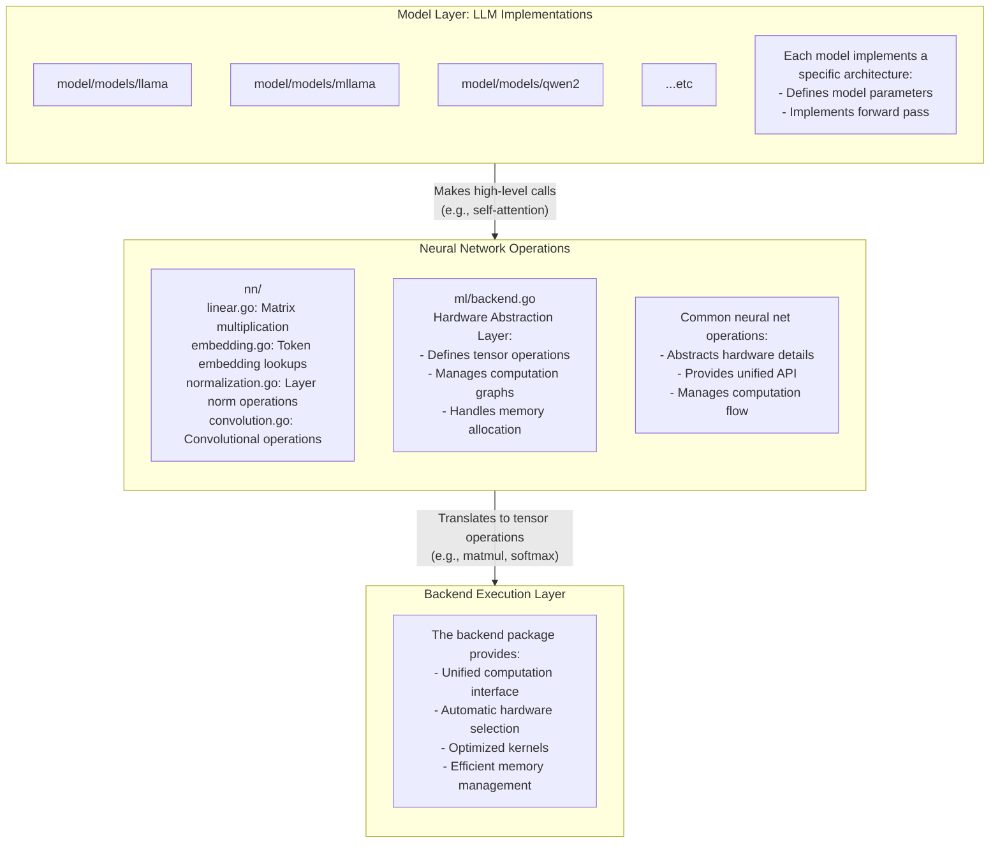

# Guide: Implementing Models in Ollama's Go Inference Engine

> **Note**: This guide and the Go inference engine are in early development and will be updated as implementation details evolve.

This guide outlines the process of implementing a new model in Ollama's inference engine. It covers everything from initial setup to publishing your model to ollama.com.

## Architecture Overview

Below is a diagram showing Ollama's inference engine architecture layers and how they interact:



When implementing a new model, you'll primarily work in the model layer, interfacing with the neural network operations layer.

## Implementation Process Overview

Here's the high-level process for implementing a new model in Ollama:

1. **Environment Setup**: Clone the repository and set up your development environment
2. **Research Implementation**: Understand the original model architecture
3. **Project Structure Setup**: Set up the necessary file structure
4. **Create Basic Modelfile**: Create a simple Modelfile for testing
5. **Implement Weight Conversion**: Map from original format to GGUF
6. **Open a Draft PR**: Create a draft pull request to establish communication with maintainers
7. **Implement Model Logic**: Create the model architecture and forward pass
8. **Quality Check and Final Steps**: Create a Modelfile, add tests and ensure functionality
10. **Finalize PR and Publish**: Complete the PR and publish to ollama.com

## Implementation Steps in Detail

### 1. Environment Setup

First, clone the Ollama repository and get it running locally. Follow the development setup guide at:
https://github.com/ollama/ollama/blob/main/docs/development.md

### 2. Research Implementation

Get the original model implementation running. This typically involves:
- Cloning the research code repository (usually Python-based)
- Setting up the required environment
- Running inference with sample inputs
- Understanding the model architecture and forward pass

### 3. Project Structure Setup

Create the necessary file structure by referencing previous model implementations. You'll need:

```
convert/
└── convert_your-model.go # Weight conversion logic (PyTorch/SafeTensors to GGML)
model/
└── your-model/
    └── model.go         # Architecture and forward pass implementation
```

Add your model to the main paths in [model/models/models.go](https://github.com/ollama/ollama/blob/main/model/models/models.go):

```
package models

import (
    _ "github.com/ollama/ollama/model/models/llama"
    _ "github.com/ollama/ollama/model/models/mllama"
    _ "github.com/ollama/ollama/model/models/your-model"  // Add your model here
)
```

### 4. Create a Basic Modelfile

Create a simple Modelfile early in the process to facilitate testing:

```
FROM /path/to/model
TEMPLATE "{{.Prompt}}" # Use a static prompt format for initial testing
```

This allows you to test your implementation with consistent inputs before finalizing the proper prompt template.

### 5. Implement Weight Conversion

- Work on `convert/convert_your-model.go`
- Reference existing conversion implementations
- Conversion involves mapping from PyTorch/SafeTensors naming to GGUF naming as you see fit
- Understand typical GGUF layout and structure:
  
  **Typical GGUF Layout:**
  ```
  GGUF
  ├── Metadata Section
  │   ├── Model Parameters
  │   │   ├── General architecture parameters 
  │   │   │   ├── "{arch}.vocab_size" (e.g., "llama.vocab_size") 
  │   │   │   ├── "{arch}.context_length" (e.g., "llama.context_length")
  │   │   │   ├── "{arch}.embedding_length" (e.g., "llama.embedding_length")
  │   │   │   └── "{arch}.block_count" (e.g., "llama.block_count")
  │   │   │
  │   │   └── Architecture-specific parameters
  │   │       ├── "{arch}.attention.head_count" (e.g., "llama.attention.head_count")
  │   │       ├── "{arch}.attention.head_count_kv" (e.g., "llama.attention.head_count_kv")
  │   │       ├── "{arch}.rope.dimension_count" (e.g., "llama.rope.dimension_count")
  │   │       └── "{arch}.attention.layer_norm_rms_epsilon" (e.g., "llama.attention.layer_norm_rms_epsilon")
  │   │
  │   ├── Tokenizer parameters
  │   │   ├── "tokenizer.ggml.model" (e.g., "llama")
  │   │   ├── "tokenizer.ggml.tokens" (vocabulary tokens)
  │   │   ├── "tokenizer.ggml.bos_id" (beginning of sequence token ID)
  │   │   └── "tokenizer.ggml.eos_id" (end of sequence token ID)
  │   │
  │   └── General metadata
  │       └── "general.architecture" (e.g., "llama", "qwen2", "phi")
  │
  └── Tensor Data Section
      ├── Common tensors:
      │   ├── "token_embd.weight" (token embedding matrix)
      │   ├── "rope_freqs.weight" (RoPE frequency weights)
      │   ├── "output_norm.weight" (final layer normalization)
      │   └── "output.weight" (output projection)
      │
      └── Layer-specific tensors:
          ├── "blk.{i}.attn_q.weight" (query projection)
          ├── "blk.{i}.attn_k.weight" (key projection) 
          ├── "blk.{i}.attn_v.weight" (value projection)
          ├── "blk.{i}.attn_output.weight" (attention output)
          ├── "blk.{i}.attn_norm.weight" (attention normalization)
          ├── "blk.{i}.ffn_norm.weight" (feed-forward normalization)
          ├── "blk.{i}.ffn_up.weight" (FFN up projection)
          ├── "blk.{i}.ffn_down.weight" (FFN down projection)
          └── "blk.{i}.ffn_gate.weight" (FFN gate projection)
  ```

  - Key conversion details include:
    - Linear weight matrices (sometimes need transposition)
    - Layer normalization weights (might need reshaping)
    - **Note: In GGML, FFN values are for the MLP (Multi-Layer Perceptron) part of the architecture**

- Test conversion:
  ```bash
  go run . create <my-model> -f /path/to/Modelfile
  ```

### 6. Open a Draft PR

After implementing the initial weight conversion, creating a draft pull request is recommended as it:
- Establishes a communication channel with Ollama maintainers
- Allows for early feedback on your approach
- Makes it easier to track progress and changes

To open a draft PR:
1. Fork the repository
2. Create a new branch for your model implementation
3. Make initial commits with your weight conversion implementation
4. Open a PR in the `ollama/ollama` repository and mark it as draft
5. Include a clear description of the model you're implementing

### 7. Implement Model Logic

- Reference existing model implementations
- Implement `New()` and `Forward()` functions in `model.go`:
  
  **The `New()` function:**
  - Creates and initializes your model structure
  - Loads configuration parameters (embedding size, attention heads, etc.)
  - Sets up the tokenizer with vocabulary and special tokens
  - Initializes all model layers and weights
  - **Important**: Sets up the KV cache for efficient inference
  - Example:
    ```go
    func New(c ml.Config) (model.Model, error) {
        m := &Model{
            // Initialize tokenizer
            BytePairEncoding: model.NewBytePairEncoding(...),
            // Create layer arrays
            Layers: make([]Layer, c.Uint("block_count")),
            // Set model parameters
            Options: &Options{...},
        }
        // Initialize KV cache for efficient inference
        m.Cache = kvcache.NewCausalCache(m.Shift)
        return m, nil
    }
    ```
  
  **The `Forward()` function:**
  - **What it does**: Defines the computational graph of your model
  - **Important**: The graph is NOT executed immediately - it's built first, then executed later when predictions are needed
  - Takes input tokens and converts them to embeddings
  - Processes inputs through transformer layers (attention and feed-forward networks)
  - Creates the path for data flow through your model's components
  - Example:
    ```go
    func (m *Model) Forward(ctx ml.Context, opts model.Options) (ml.Tensor, error) {
        // Convert inputs to tensors
        inputTensor, _ := ctx.FromIntSlice(opts.Inputs, len(opts.Inputs))
        positionsTensor, _ := ctx.FromIntSlice(opts.Positions, len(opts.Positions))
        
        // Initial token embedding
        hiddenStates := m.TokenEmbedding.Forward(ctx, inputTensor)
        
        // Process through transformer layers
        for i, layer := range m.Layers {
            m.Cache.SetLayer(i)
            hiddenStates = layer.Forward(ctx, hiddenStates, positionsTensor, m.Cache, m.Options)
        }
        
        // Final processing and output
        normalizedOutput := m.OutputNorm.Forward(ctx, hiddenStates, m.modelEpsilon)
        logits := m.Output.Forward(ctx, normalizedOutput)
        
        // Return logits for requested positions
        outputsTensor, _ := ctx.FromIntSlice(opts.Outputs, len(opts.Outputs))
        return logits.Rows(ctx, outputsTensor), nil
    }
    ```

  **Key Components to Implement:**

  1. **KV Cache**:
     - Improves inference performance for text generation
     - How it works: Stores previously computed key and value tensors from self-attention, avoiding redundant computations
     - Implementation: Use the `kvcache.NewCausalCache()` for autoregressive models
     - Important: Must implement the `Shift()` function to handle rotary position embeddings with the cache

  2. **Self-Attention**:
     - Core component that learns contextual relationships between tokens
     - Implements query, key, value projections and their interactions
     - Must handle positional encoding (usually Rotary Position Embeddings)
     - Uses the KV cache to make generation efficient

  3. **Normalization Layers**:
     - Purpose: Stabilizes training and maintains consistent activation distributions
     - Types: RMSNorm, LayerNorm, etc. depending on model architecture
     - Implementation: Apply before attention and feed-forward networks
     - Example: `normalizedOutput := m.OutputNorm.Forward(ctx, hiddenStates, m.modelEpsilon)`

  4. **Activation Functions**:
     - Purpose: Introduces non-linearity into the model
     - Common types: SILU (Sigmoid Linear Unit), GELU, ReLU
     - Found in feed-forward/MLP blocks
     - Example:
     ```go
     // SwiGLU activation in MLP
     gateActivation := mlp.Gate.Forward(ctx, hiddenState).SILU(ctx)
     upProjection := mlp.Up.Forward(ctx, hiddenState)
     intermediateStates := gateActivation.Mul(ctx, upProjection)
     ```
- Run your forward pass:
  ```bash
  # in the root of the ollama directory
  go build .
  OLLAMA_DEBUG=1 ./ollama serve
  OLLAMA_DEBUG=1 ./ollama run <my-model>
  ```
- Compare output with research implementation

### 8. Quality Check and Final Steps

1. Add comprehensive tests to:
   - `model_test.go`
   - `convert_test.go`

2. Ensure tests cover:
   - Weight conversion
   - Model initialization
   - Text generation

3. **Create Final Modelfile**
   - Replace the static prompt with the proper Go template for your model:
     ```
     FROM <converted-gguf>
     TEMPLATE <prompt-template>    # Add the proper Go template for your model, including tools if needed
     LICENSE <license-info>        # Add appropriate license information
     # Add additional parameters if needed
     ```

4. **End-to-end Testing**
   - Run your model with your local Ollama build to ensure that it functions as expected

5. Benchmark
   - Run performance benchmarks on your model implementation
   ```go
   # from the root of the Ollama directory, while a server is running locally
   go build .
   OLLAMA_DEBUG=1 ./ollama serve
   go test -bench=. -m <your-model-name> ./...
   ```

### 9. Finalize PR and Publish to ollama.com

1. **Finalize Pull Request**
   - Move PR out of draft state
   - Address reviewer feedback

2. **Publish to ollama.com**
   - Push to ollama.com:
     ```bash
     ollama create <your-namespace>/<your-model> -f /path/to/Modelfile
     ollama push <your-namespace>/<your-model>
     ```