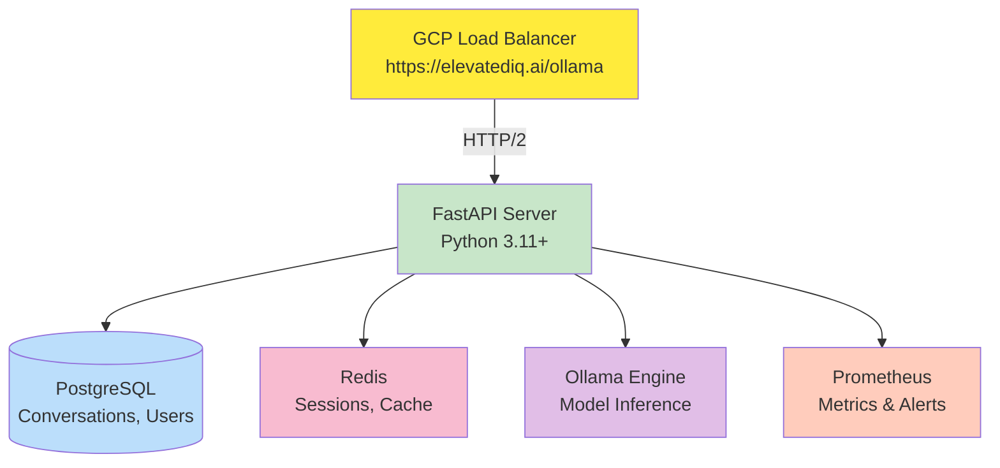
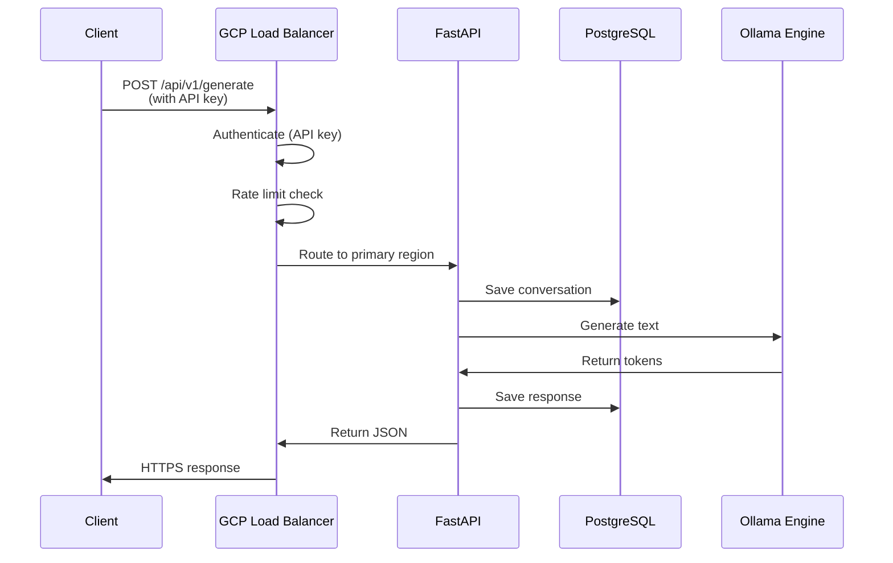
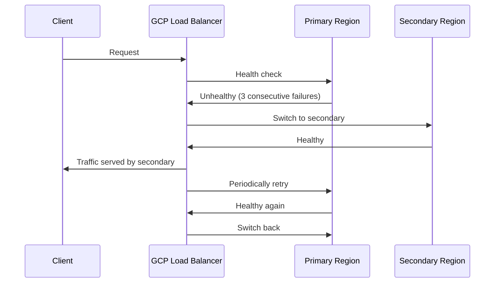

# System Design

Ollama is designed for enterprise-grade reliability, security, and performance.

## Core Components



## Architecture Principles

### 1. Single Entry Point

- All external traffic through GCP Load Balancer
- Load Balancer handles authentication, rate limiting, TLS termination
- Internal services isolated, not directly accessible

### 2. Stateless API

- FastAPI server can be horizontally scaled
- Session state stored in Redis
- Database handles persistent data
- No local file storage (except models)

### 3. Containerized Microservices

- Each service runs in Docker container
- Service discovery via Docker network names
- Mutual TLS for internal communication

### 4. Resilience Patterns

- Circuit breakers prevent cascading failures
- Outlier detection ejects unhealthy backends
- Health checks every 10 seconds
- Graceful connection draining (10s timeout)

## Data Flow

### Request Flow



### Failover Flow



## Technology Stack

| Layer            | Technology     | Version |
| ---------------- | -------------- | ------- |
| Web Server       | FastAPI        | 0.104+  |
| Application      | Python         | 3.11+   |
| Database         | PostgreSQL     | 15+     |
| Cache            | Redis          | 7+      |
| Inference        | Ollama         | Latest  |
| Containerization | Docker         | 24+     |
| Orchestration    | Docker Compose | 2.20+   |
| Infrastructure   | GCP            | -       |
| Load Balancer    | GCP HTTP(S) LB | v1      |
| Monitoring       | Prometheus     | 2.45+   |
| Logging          | Structlog      | 23+     |

## Scalability

### Horizontal Scaling

```yaml
# Scale API servers (stateless)
docker-compose up -d --scale api=5
# Load Balancer distributes traffic
# Redis handles session state
# PostgreSQL handles persistent data
```

### Vertical Scaling

- Increase FastAPI worker count: `workers: 16`
- Increase database connections: `pool_size: 20`
- Increase Redis memory: `maxmemory: 4gb`

## Performance Characteristics

- API response time: < 500ms p95 (excluding inference)
- Inference latency: Model-dependent (documented per model)
- Concurrent requests: 1000+ with proper resource allocation
- Database queries: < 100ms p95
- Cache hit rate: > 80%

See [Performance Baseline](../resources/references.md) for detailed metrics.
