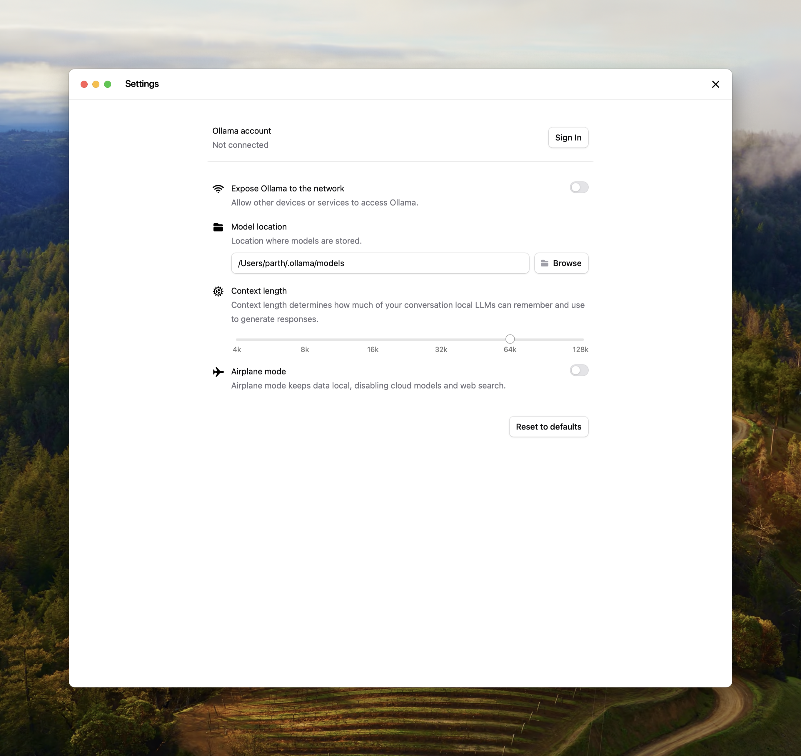

Context length is the maximum number of tokens that the model has access to in memory.  

<Note>
  Ollama defaults to the following context lengths based on VRAM:
    - < 24 GiB VRAM: 4k context
    - 24-48 GiB VRAM: 32k context
    - &gt;= 48 GiB VRAM: 256k context
</Note>

Tasks which require large context like web search, agents, and coding tools should be set to at least 64000 tokens.

## Setting context length

Setting a larger context length will increase the amount of memory required to run a model. Ensure you have enough VRAM available to increase the context length.

Cloud models are set to their maximum context length by default.

### App

Change the slider in the Ollama app under settings to your desired context length.


### CLI
If editing the context length for Ollama is not possible, the context length can also be updated when serving Ollama.  
```
OLLAMA_CONTEXT_LENGTH=64000 ollama serve
```

### Check allocated context length and model offloading
For best performance, use the maximum context length for a model, and avoid offloading the model to CPU. Verify the split under `PROCESSOR` using `ollama ps`.
```
ollama ps
```
```
NAME             ID              SIZE      PROCESSOR    CONTEXT    UNTIL
gemma3:latest    a2af6cc3eb7f    6.6 GB    100% GPU     65536      2 minutes from now
```
