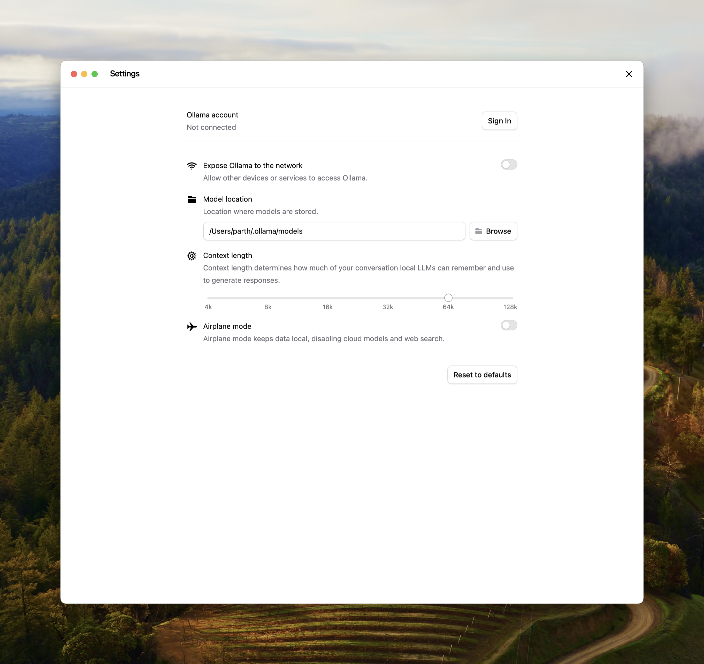

Context length is the maximum number of tokens that the model has access to in memory.  

<Note>
  Ollama defaults to the following context lengths based on VRAM:
    - < 24 GiB VRAM: 4k context
    - 24-48 GiB VRAM: 32k context
    - &gt;= 48 GiB VRAM: 256k context
</Note>

Tasks which require large context like web search, agents, and coding tools should be set to at least 64000 tokens.

## Setting context length

Setting a larger context length will increase the amount of memory required to run a model. Ensure you have enough VRAM available to increase the context length.

Cloud models are set to their maximum context length by default.

### App

Change the slider in the Ollama app under settings to your desired context length.


### CLI
If editing the context length for Ollama is not possible, the context length can also be updated when serving Ollama.  
```
OLLAMA_CONTEXT_LENGTH=64000 ollama serve
```

### Check allocated context length and model offloading
For best performance, use the maximum context length for a model, and avoid offloading the model to CPU. Verify the split under `PROCESSOR` using `ollama ps`.
```
ollama ps
```
```
NAME             ID              SIZE      PROCESSOR    CONTEXT    UNTIL
gemma4:latest    c6eb396dbd59    9.6 GB    100% GPU     131072     2 minutes from now
```

## When a prompt exceeds the context length

By default a request whose prompt does not fit is not rejected. Ollama shortens the input and returns `200`, so an over-long prompt can look like an ordinary successful request that quietly saw less than was sent.

Two parameters on `/api/chat` and `/api/generate` control this. Both default to `true`.

- `truncate`: drop the oldest messages until the rendered prompt fits. The most recent message and any system messages are always kept. Set it to `false` to receive an error instead of a shortened prompt.
- `shift`: shift the chat history when the context limit is reached during generation, instead of erroring.

### Checking whether the prompt was shortened

The response reports how many tokens the model actually processed. Compare `prompt_eval_count` against the size of the input that was sent — a value well below it means the prompt was shortened.

To turn the silent case into an explicit one, send `truncate` as `false`:

```shell
curl http://localhost:11434/api/chat -d '{
  "model": "qwen3:4b",
  "messages": [{ "role": "user", "content": "..." }],
  "truncate": false
}'
```

<Note>
  Not every model reaches this path. For some models the prompt is processed by the runner, which rejects an over-long prompt with an error even when `truncate` is left at its default. Which path a model takes follows the template it resolves to, shown in the `template` field of `/api/show`. This is why two models on the same server can respond differently to the same over-long prompt.
</Note>
