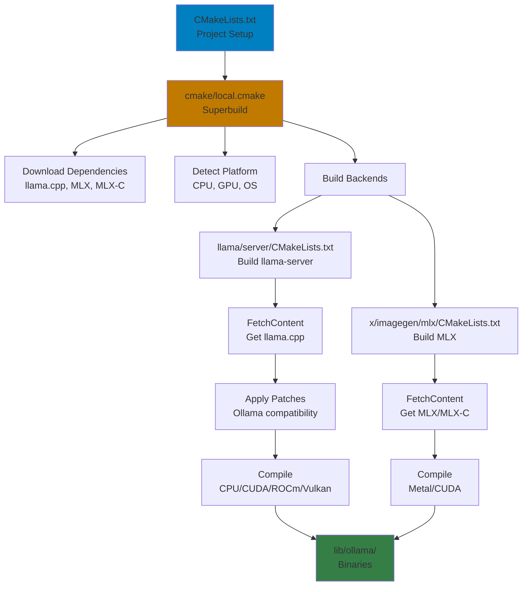

# Development_inventory

# Go Dependencies

Go is the primary language for this project using **version 1.26.0**.

## Primary Dependencies

- **`github.com/TheTitanrain/w32`** (v0.0.0-20180517000239-4f5cfb03fabf) - Windows API bindings for Go
- **`github.com/containerd/console`** (v1.0.3) - Console/terminal handling library
- **`github.com/gin-gonic/gin`** (v1.10.0) - HTTP web framework for building REST APIs
- **`github.com/golang/protobuf`** (v1.5.4) - Protocol Buffers for Go (indirect dependency)
- **`github.com/google/go-cmp`** (v0.7.0) - Package for comparing Go values in tests
- **`github.com/google/uuid`** (v1.6.0) - UUID generation and parsing
- **`github.com/ledongthuc/pdf`** (v0.0.0-20250511090121-5959a4027728) - PDF parsing library
- **`github.com/mattn/go-sqlite3`** (v1.14.24) - SQLite3 driver for Go's database/sql
- **`github.com/olekukonko/tablewriter`** (v0.0.5) - ASCII table generation for terminal output
- **`github.com/spf13/cobra`** (v1.7.0) - CLI application framework
- **`github.com/stretchr/testify`** (v1.10.0) - Testing toolkit with assertions and mocks
- **`github.com/x448/float16`** (v0.8.4) - IEEE 754 half-precision floating-point format
- **`golang.org/x/sync`** (v0.17.0) - Synchronization primitives
- **`golang.org/x/sys`** (v0.37.0) - Low-level operating system primitives

## Additional Requirements

- **`github.com/agnivade/levenshtein`** (v1.1.1) - Levenshtein distance algorithm for string similarity
- **`github.com/charmbracelet/bubbletea`** (v1.3.10) - TUI framework for building terminal applications
- **`github.com/charmbracelet/lipgloss`** (v1.1.0) - Style definitions for terminal output
- **`github.com/d4l3k/go-bfloat16`** (v0.0.0-20211005043715-690c3bdd05f1) - Brain floating-point format support
- **`github.com/dlclark/regexp2`** (v1.11.5) - Full-featured regex engine with backtracking
- **`github.com/emirpasic/gods/v2`** (v2.0.0-alpha) - Go data structures library
- **`github.com/klauspost/compress`** (v1.18.3) - Optimized compression algorithms
- **`github.com/mattn/go-runewidth`** (v0.0.16) - Unicode character width calculation
- **`github.com/nlpodyssey/gopickle`** (v0.3.0) - Python pickle format parser
- **`github.com/pdevine/tensor`** (v0.0.0-20240510204454-f88f4562727c) - Tensor operations library
- **`github.com/pelletier/go-toml/v2`** (v2.2.2) - TOML parser and encoder
- **`github.com/pkg/browser`** (v0.0.0-20240102092130-5ac0b6a4141c) - Cross-platform browser launcher
- **`github.com/tkrajina/typescriptify-golang-structs`** (v0.2.0) - Convert Go structs to TypeScript interfaces
- **`github.com/tree-sitter/go-tree-sitter`** (v0.25.0) - Tree-sitter parser bindings for code analysis
- **`github.com/tree-sitter/tree-sitter-cpp`** (v0.23.4) - C++ grammar for tree-sitter
- **`github.com/wk8/go-ordered-map/v2`** (v2.1.8) - Ordered map implementation
- **`golang.org/x/image`** (v0.22.0) - Image processing libraries
- **`golang.org/x/mod`** (v0.30.0) - Go module utilities
- **`golang.org/x/tools`** (v0.38.0) - Go development tools
- **`gonum.org/v1/gonum`** (v0.15.0) - Numerical computing library

## Transitive Dependencies (Indirect)

Over 60 additional packages are pulled in as transitive dependencies, including:
- Apache Arrow for columnar data
- Terminal color and styling libraries
- JSON/YAML parsers
- Cryptography libraries
- Protocol buffer support
- Testing utilities

## Dependency Management

- **`go.mod`** - Declares all Go dependencies with their versions
- **`go.sum`** - Contains cryptographic checksums to verify dependency integrity
- Go's module system automatically downloads and caches dependencies

---

# C/C++ Dependencies

C/C++ dependencies are managed through **CMake files** for the build process of the Ollama project.

## CMake Build System

CMake files orchestrate:
- Project setup and configuration
- Cross-platform compilation
- Architecture detection (x86_64, arm64, s390x)
- GPU backend selection
- External dependency management

### Key CMake Files

1. **`CMakeLists.txt`** - Root project configuration
   - Detects when building for different architectures
   - Uses C++17 with GNU extensions
   - Sets output directories

2. **`cmake/local.cmake`** - Superbuild orchestrator
   - Downloads llama.cpp from GitHub
   - Defines GPU backends to build (CUDA, ROCm, Vulkan, Metal)
   - Detects operating system
   - Manages external projects

3. **`llama/server/CMakeLists.txt`** - Builds llama-server
   - Fetches llama.cpp source
   - Applies Ollama compatibility patches
   - Compiles for CPU/CUDA/ROCm/Vulkan

4. **`x/imagegen/mlx/CMakeLists.txt`** - Builds Apple's ML framework (MLX) for image generation

## Build Process Flow

## Known Issues

- **quant.c not found** - [Issue #16318](https://github.com/ollama/ollama/issues/16318)

---

# Performance Optimization Technologies

Critical performance optimization technologies used in Ollama for accelerating AI model inference:

## SIMD (Single Instruction, Multiple Data)

- **What:** CPU instruction sets that process multiple data points simultaneously
- **Used for:** Fast tokenization and vector operations
- **Variants:** AVX/SSE (x86_64), NEON (ARM), VXE (s390x)

## VXE (Vector Extension for s390x)

- **What:** IBM Z's SIMD instruction set for vector processing
- **Purpose:** Provides hardware acceleration for AI workloads on IBM Z
- **Requirement:** llama.cpp and GGML need to use VXE instructions for optimal performance on s390x

## BLAS (Basic Linear Algebra Subprograms)

- **What:** Optimized library for matrix/vector operations
- **Used for:** Neural network computations, matrix multiplications
- **Implementations:** OpenBLAS, Intel MKL, Apple Accelerate

## GPU Math Libraries

- **cuBLAS** - NVIDIA's GPU-accelerated BLAS for CUDA
- **rocBLAS** - AMD's GPU-accelerated BLAS for ROCm
- **hipBLAS** - Portable BLAS API for both CUDA and ROCm