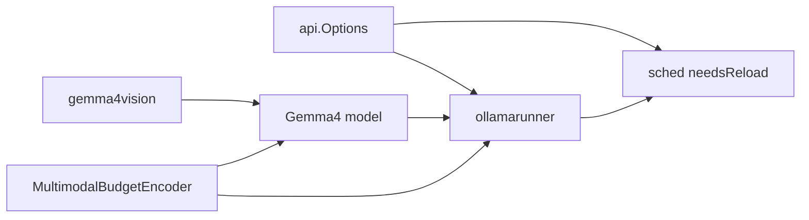
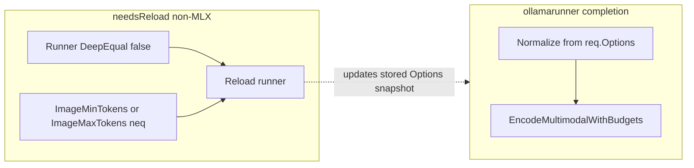

# Gemma4 visual token budgets + reload parity with `num_ctx`

**Table of contents:** [Goals / non-goals](#goals-and-non-goals) · [PR outline](#feature-request--pull-request-outline) · [Implementation order](#recommended-implementation-order) · [Acceptance criteria](#acceptance-criteria) · [Consistency audit](#consistency-review-pre-implementation-audit) · [References and semantics](#references-and-semantics) · **§1–§7** (technical sections below) · [Debug logging](#debug-logging) · [Testing and sign-off](#testing-and-sign-off) · [Mermaid](#mermaid-reload-vs-encode) · [Internal verification](#internal-verification-latest-pass) · [Plan history](#removed--corrected-from-prior-plan)

## Goals and non-goals

**Goals**

- Expose Gemma 4 visual **token budgets** (Google ladder 70–1120) via **`image_min_tokens` / `image_max_tokens`** on [`api.Options`](ollama/api/types.go), with nearest snap and defaults **70** / **560** when unset (`0`).
- Apply resolved budgets on **every** multimodal encode in [`ollamarunner`](ollama/runner/ollamarunner/runner.go) (same request path as other completion-time options).
- On **non-MLX**, trigger **runner reload** when merged options change for those two fields, **in addition to** existing `Runner` DeepEqual—without comparing full `api.Options`.

**Non-goals**

- **llamarunner** / llama.cpp `mtmd` path: Gemma 4 is [`OllamaEngineRequired`](ollama/fs/ggml/ggml.go); no duplicate implementation there unless a future compat path loads Gemma4 vision through it.
- **MLX** vision encode: not implemented; fields may pass through JSON and optional debug logging only.
- Changing tokenizer behavior, KV layout, or GGUF `LoadRequest` fields for these keys (no load-time overlay).

## Feature request / pull request outline

Use this section as the basis for a GitHub **issue** (feature request), **PR description**, or internal design note. Link to this plan file path in the PR for reviewers.

### Summary

Expose Gemma 4–style **visual token budgets** on `api.Options` as **`image_min_tokens`** and **`image_max_tokens`**, snapping to `{70,140,280,560,1120}` with defaults **70** / **560** when unset. Apply budgets when encoding images in the GGUF **ollamarunner** path (Gemma 4). On **non-MLX** schedulers, changing merged options for these keys **unloads and reloads** the runner, **alongside** existing `Runner` / `num_ctx`–style diffs—without `DeepEqual` on full `api.Options`.

### Problem

- Today Gemma 4 preprocessing uses fixed implicit token-derived pixel bounds (e.g. min/max not aligned with Google’s published ladder or user intent).
- Callers cannot tune speed vs detail via Modelfile or per-request `options`.
- Scheduler reload logic must stay precise: reload on load-affecting option changes, not on every sampling tweak.

### Proposed solution

- Shared helper package [`internal/gemma4vision`](ollama/internal/gemma4vision): ladder constant, `MaxGemma4VisualTokens` (1120), snap + normalize + tests.
- New [`MultimodalBudgetEncoder`](ollama/model/model.go) interface + Gemma 4 `EncodeMultimodalWithBudgets` and `ProcessImageWithBudgets` / `smartResize` min+max.
- Runner threads normalized budgets per completion; `reserveWorstCaseGraph` uses **max** ladder for budgeted encoders.
- [`needsReload`](ollama/server/sched.go): for non-MLX, `Runner` DeepEqual **or** `ImageMinTokens` / `ImageMaxTokens` inequality.
- **`OLLAMA_DEBUG=1`:** structured `slog.Debug` in Gemma4 vision encode (optional runner) for input WxH, token budgets, and output image token count — [Debug logging](#debug-logging).

### User-visible behavior

- Modelfile / API `options` may set **`image_min_tokens`** and **`image_max_tokens`** (Gemma 4 **visual token budgets** on `{70,140,280,560,1120}`, not literal image pixel dimensions—naming avoids implying a pixel-size cap).
- `0` or omitted = defaults 70 / 560 independently.
- After implementation, changing only these fields between requests can force a **runner reload** on GGUF non-MLX (same class of behavior as changing `num_ctx` on that path).

### API / compatibility

- **Additive** JSON fields on `api.Options`; existing clients unchanged.
- **Behavior change** for Gemma 4 vision: default preprocess bounds move from current hardcoded behavior to **70 / 560** ladder-aligned semantics—call out in PR as a possible output shift for edge image sizes.

### Testing / verification (for PR description)

- Point to **Testing and sign-off** in this plan; list packages touched and `go test` commands run in CI.

### Documentation follow-ups (outside this code plan)

- Short mention in release notes / changelog.
- Optional: extend public API or Modelfile docs to describe token-budget semantics and the ladder.

---

## Recommended implementation order

Dependencies are mostly linear; `api.Options` can land early in parallel with `gemma4vision` (no import cycle: `gemma4vision` must **not** import `api`).

| Step | Work | Rationale |
| --- | --- | --- |
| 1 | [`internal/gemma4vision`](ollama/internal/gemma4vision) + tests | Pure helpers; no ollama imports. |
| 2 | [`api.Options`](ollama/api/types.go) fields + JSON tags | Types used everywhere. |
| 3 | [`MultimodalBudgetEncoder`](ollama/model/model.go) | Small interface before implementations. |
| 4 | Gemma4 [`model.go`](ollama/model/models/gemma4/model.go) + [`process_image.go`](ollama/model/models/gemma4/process_image.go) + tests + **`slog.Debug` vision summary** | Implements interface, resize, and OLLAMA_DEBUG-friendly logs. |
| 5 | [`ollamarunner/runner.go`](ollama/runner/ollamarunner/runner.go): params, `completion`, `NewSequence` → `inputs(..., min, max)`, `reserveWorstCaseGraph` | Only **one** `inputs` call site today (line ~135); verify with `rg '\\.inputs\\(' ollamarunner` after edits. |
| 6 | [`sched.go needsReload`](ollama/server/sched.go) + [`sched_test.go`](ollama/server/sched_test.go) | Uses new `Options` fields. |
| 7 | MLX stub, [`routes.go`](ollama/server/routes.go) show allowlist, comments | Polish. |



## Acceptance criteria

- [ ] `SnapGemma4VisualTokens` / `NormalizeGemma4ImageBudgets` fully tested; tie-break and `min > max` after snap documented in tests.
- [ ] Gemma4 `EncodeMultimodal` without budgets uses **70 / 560** normalized defaults (backward-compatible call sites).
- [ ] Completion path: `req.Options` drives normalize → `EncodeMultimodalWithBudgets` for Gemma4; other multimodal models unchanged (type assert fails → `EncodeMultimodal`).
- [ ] `reserveWorstCaseGraph` uses **maximum** visual budget (1120 max tokens) for `MultimodalBudgetEncoder` so VRAM probe is not optimistic.
- [ ] Non-MLX `needsReload` returns true when **only** `ImageMinTokens` or `ImageMaxTokens` differs between stored `runner.Options` and `req.opts` (extend `TestSchedNeedsReload` or add focused test).
- [ ] No full `api.Options` DeepEqual in `needsReload`; sampling / temperature changes do not reload.
- [ ] With `OLLAMA_DEBUG=1`, a single structured **`slog.Debug`** (or small set) in the Gemma4 vision encode path surfaces input size, normalized min/max token budgets, and output image token count (see [Debug logging](#debug-logging)).

## Consistency review (pre-implementation audit)

| Topic | Resolution |
| --- | --- |
| Reload vs per-request encode | Reload updates the scheduler’s stored `runner.Options` snapshot when merged `image_*` change (GGUF). Each completion still encodes from `req.Options` in the subprocess—no contradiction. |
| “Same as `num_ctx`” vs fields not on `Runner` | Parity is **behavioral** (non-MLX reload branch), not struct layout: compare `ImageMinTokens` / `ImageMaxTokens` alongside `DeepEqual(Runner)`. |
| MLX | Today `needsReload` skips `Runner` for MLX, so **`num_ctx` does not reload MLX** either; image keys follow the same rule unless a follow-up adds an MLX-specific comparison. |
| `SnapGemma4VisualTokens` and zero | **`NormalizeGemma4ImageBudgets`** is the only entry for raw API ints; it never calls `Snap` with unset `0`. If `Snap` is exported, document contract: **`n` must be positive** (callers use `Normalize` for raw API values), or define `Snap(0)` as a documented default to avoid accidental misuse. |
| Tie-break for snap | Prefer **lower** ladder value on ties; test row for **105** (mid 70–140) expects **70** under that rule. |
| `reserveWorstCaseGraph` | `NormalizeGemma4ImageBudgets(0, 1120)` yields default min **70** and snapped max **1120**—appropriate upper bound for VRAM probe. Prefer `gemma4vision.MaxGemma4VisualTokens` constant in code. |
| Mermaid below | Diagram uses **OR** semantics (`runnerOptsChanged \|\| imageBudgetsChanged`), not a pipeline. |
| Ollama engine vs default runner | [`OllamaEngineRequired`](ollama/fs/ggml/ggml.go) includes **`gemma4`**; production Gemma 4 loads through **`ollamarunner`** when the new engine path succeeds. **`llamarunner`** uses llama.cpp `mtmd` for vision and is not the target for this Go-side `EncodeMultimodal` work. |
| `NewSequence` vs `inputs` | `NewSequence` calls `s.inputs(prompt, images)` **before** building `*Sequence`. Pass budgets via **`NewSequenceParams` → `inputs(..., minTok, maxTok)`** (or pass `params`). |

## References and semantics

**Sources**

- [Gemma 4 Core](https://ai.google.dev/gemma/docs/core)
- [Vision — token budgets](https://ai.google.dev/gemma/docs/capabilities/vision)

**Semantics**

- JSON keys **`image_min_tokens`** and **`image_max_tokens`** map to **visual token budgets** `{70,140,280,560,1120}` via nearest snap; `0` = unset → defaults **70** / **560** independently; then enforce `minTok <= maxTok` (plan: if `minTok > maxTok` after snap, set `maxTok = minTok`).
- `omitempty` only affects marshal; `FromMap` / JSON decode leave `0` when absent.

**Public API naming (`*_tokens`, not `*_pixels`)**

- **`image_min_tokens` / `image_max_tokens`** match [Google’s wording](https://ai.google.dev/gemma/docs/capabilities/vision) (**visual token budgets**) and avoid misleading users into thinking Ollama is capping **bitmap width/height in pixels** (which would be a different feature).
- Go fields: **`ImageMinTokens`**, **`ImageMaxTokens`** with matching `json` tags. Internal helpers may still say “image” in the sense of **image modality** (e.g. `NormalizeGemma4ImageBudgets`)—rename in code if you prefer stricter vocabulary.

**Edge cases (decide in implementation, cover in tests)**

- **Negative raw values:** Treat as invalid input: either clamp to `1` before snap, snap absolute value, or treat as unset—**pick one** and document; avoid silent ladder mis-selection.
- **Values above 1120:** Define `SnapGemma4VisualTokens` so any raw value **≥ 1120** maps to **`MaxGemma4VisualTokens` (1120)** (or use “nearest ladder” capped at 1120—**one rule only**, covered by tests).
- **`req.opts` nil:** `needsReload` assumes a loaded runner has non-nil `runner.Options`; if `req.opts` can be nil on some paths, guard before field compare (match existing style in `sched.go`).

## 1) [`internal/gemma4vision/budget.go`](ollama/internal/gemma4vision/budget.go) + tests

```go
package gemma4vision

// Doc: https://ai.google.dev/gemma/docs/capabilities/vision — visual token budgets.

var Gemma4VisualTokenBudgets = []int{70, 140, 280, 560, 1120}

const (
	DefaultGemma4ImageMinTokens = 70
	DefaultGemma4ImageMaxTokens = 560
	MaxGemma4VisualTokens        = 1120
)

// SnapGemma4VisualTokens returns the nearest ladder value to n.
// Contract: n must be positive (use NormalizeGemma4ImageBudgets for raw API ints, including unset 0).
// For ties (exactly between two rungs), prefer the lower budget (less VRAM).
func SnapGemma4VisualTokens(n int) int { /* iterate ladder, min abs diff; tie -> lower */ }

func NormalizeGemma4ImageBudgets(minRaw, maxRaw int) (minTok, maxTok int) {
	if minRaw == 0 {
		minTok = DefaultGemma4ImageMinTokens
	} else {
		minTok = SnapGemma4VisualTokens(minRaw) // validate minRaw per edge-case policy
	}
	if maxRaw == 0 {
		maxTok = DefaultGemma4ImageMaxTokens
	} else {
		maxTok = SnapGemma4VisualTokens(maxRaw)
	}
	if minTok > maxTok {
		maxTok = minTok
	}
	return minTok, maxTok
}
```

[`budget_test.go`](ollama/internal/gemma4vision/budget_test.go): table tests for snap edges (69→70, 105→70), defaults, min>max normalization, optional negative/overflow rows once policy is fixed.

## 2) [`api/types.go`](ollama/api/types.go)

```go
type Options struct {
	Runner `json:",inline"`
	// ... existing fields ...
	ImageMinTokens int `json:"image_min_tokens,omitempty"`
	ImageMaxTokens int `json:"image_max_tokens,omitempty"`
}
```

Keep fields on **top-level** `Options`, not on embedded `Runner`, so JSON keys stay flat like other sampling-style options.

## 3) [`model/model.go`](ollama/model/model.go)

```go
// MultimodalBudgetEncoder is implemented by models that support per-call vision token budgets (e.g. Gemma 4).
type MultimodalBudgetEncoder interface {
	EncodeMultimodalWithBudgets(ctx ml.Context, multimodalData []byte, minTokens, maxTokens int) ([]input.Multimodal, error)
}
```

## 4) Gemma4 model + preprocess

**[`model/models/gemma4/model.go`](ollama/model/models/gemma4/model.go)**

```go
func (m *Model) EncodeMultimodalWithBudgets(ctx ml.Context, multimodalData []byte, minTokens, maxTokens int) ([]input.Multimodal, error) {
	return m.encodeMultimodal(ctx, multimodalData, minTokens, maxTokens)
}

func (m *Model) EncodeMultimodal(ctx ml.Context, multimodalData []byte) ([]input.Multimodal, error) {
	minTok, maxTok := gemma4vision.NormalizeGemma4ImageBudgets(0, 0)
	return m.encodeMultimodal(ctx, multimodalData, minTok, maxTok)
}

func (m *Model) encodeMultimodal(ctx ml.Context, multimodalData []byte, minTokens, maxTokens int) ([]input.Multimodal, error) {
	// existing decode path; replace processor call with:
	pixels, w, h, err := m.ProcessImageWithBudgets(img, minTokens, maxTokens) // promoted from embedded ImageProcessor
	// ... rest unchanged ...
}
```

**[`process_image.go`](ollama/model/models/gemma4/process_image.go)** — patch geometry from `fs.Config` only:

```go
func (p *ImageProcessor) ProcessImageWithBudgets(img image.Image, minTokens, maxTokens int) ([]float32, int, int, error) {
	minPixels := minTokens * p.patchArea
	maxPixels := maxTokens * p.patchArea
	return p.processImage(img, minPixels, maxPixels)
}
```

Refactor current `ProcessImage` into `processImage` using **both** `minPixels` and `maxPixels` in `smartResize`: after sizing for max cap, if `totalPixels < minPixels`, grow (aspect + `alignSize`) until ≥ min or hit max cap; log `Warn` if infeasible.

**Tests:** add [`process_image_test.go`](ollama/model/models/gemma4/process_image_test.go) (file does not exist today) for pixel bounds modulo alignment.

## 5) Runner per-request + worst-case graph

**[`runner/ollamarunner/runner.go`](ollama/runner/ollamarunner/runner.go)**

```go
type NewSequenceParams struct {
	// Verify at edit time: numPredict, stop, numKeep, sampler, embedding, shift, truncate, logprobs, topLogprobs
	imageMinTok int
	imageMaxTok int
}
```

**`completion`:** after decoding `req`:

```go
minTok, maxTok := gemma4vision.NormalizeGemma4ImageBudgets(req.Options.ImageMinTokens, req.Options.ImageMaxTokens)
seq, err := s.NewSequence(req.Prompt, req.Images, NewSequenceParams{
	// ... existing fields ...
	imageMinTok: minTok,
	imageMaxTok: maxTok,
})
```

**`NewSequence`:** replace `s.inputs(prompt, images)` with `s.inputs(prompt, images, params.imageMinTok, params.imageMaxTok)` (zero defaults fine for embedding-only paths).

**`inputs`** — extend signature; at multimodal encode:

```go
if mb, ok := multimodalProcessor.(model.MultimodalBudgetEncoder); ok {
	imageEmbeddings, err = mb.EncodeMultimodalWithBudgets(ctx, images[imageIndex].Data, minTok, maxTok)
} else {
	imageEmbeddings, err = multimodalProcessor.EncodeMultimodal(ctx, images[imageIndex].Data)
}
```

**`reserveWorstCaseGraph`:**

```go
worstMin, worstMax := gemma4vision.NormalizeGemma4ImageBudgets(0, gemma4vision.MaxGemma4VisualTokens)
if mb, ok := multimodalProcessor.(model.MultimodalBudgetEncoder); ok {
	_, err = mb.EncodeMultimodalWithBudgets(ctx, dummyImageBytes, worstMin, worstMax)
} else {
	_, err = multimodalProcessor.EncodeMultimodal(ctx, dummyImageBytes)
}
```

## 6) Scheduler reload — **same reaction as `num_ctx`** (GGUF non-MLX)

In [`needsReload`](ollama/server/sched.go), non-MLX reload today includes `!reflect.DeepEqual(optsExisting, optsNew)` for the **embedded `Runner`** values (`optsExisting := runner.Options.Runner`, `optsNew := req.opts.Runner`). Extend that **same** `!runner.model.IsMLX()` conjunction with **OR** image budget inequality on the full `*api.Options` (top-level `ImageMinTokens` / `ImageMaxTokens`, not part of `Runner`):

```go
optsExisting := runner.Options.Runner
optsNew := req.opts.Runner
if optsNew.NumGPU < 0 {
	optsExisting.NumGPU = -1
	optsNew.NumGPU = -1
}
runnerOptsChanged := !reflect.DeepEqual(optsExisting, optsNew)
imageBudgetsChanged := runner.Options.ImageMinTokens != req.opts.ImageMinTokens ||
	runner.Options.ImageMaxTokens != req.opts.ImageMaxTokens

if !reflect.DeepEqual(runner.model.AdapterPaths, req.model.AdapterPaths) ||
	!reflect.DeepEqual(runner.model.ProjectorPaths, req.model.ProjectorPaths) ||
	(!runner.model.IsMLX() && (runnerOptsChanged || imageBudgetsChanged)) ||
	runner.llama.Ping(ctx) != nil {
	return true
}
```

Optional helper `optionsReloadGGUF(existing, new *api.Options) bool` for readability; **never** add sampling-only fields there.

## 7) MLX / show / docs

- [`x/mlxrunner`](ollama/x/mlxrunner): fields pass through JSON; optional `slog.Debug` when non-zero.
- [`server/routes.go`](ollama/server/routes.go): extend show allowlist if options are filtered.
- Brief code comments + Vision doc link in `budget.go` / `process_image.go`.

## Debug logging

Use this when the environment variable **`OLLAMA_DEBUG=1`** (or `true`) is set so [`envconfig.LogLevel`](ollama/envconfig/config.go) enables **`slog.LevelDebug`** and the ollamarunner subprocess default logger shows `Debug` records ([`Execute`](ollama/runner/ollamarunner/runner.go) calls `slog.SetDefault(logutil.NewLogger(os.Stderr, envconfig.LogLevel()))`).

**Recommended log surface** (structured key/value, **one primary line** after encode to avoid chatty logs; optional second line at decode if useful)

| Log attribute | Meaning | Where to read it |
| --- | --- | --- |
| `input_width`, `input_height` | Decoded image bounds (before resize) | `img.Bounds().Dx()`, `Dy()` after `image.Decode` on the vision path in [`model.go`](ollama/model/models/gemma4/model.go) (`encodeMultimodal` once refactored) |
| `preprocess_width`, `preprocess_height` | Tensor / model input size after resize | Return values from `ProcessImageWithBudgets` |
| `image_min_tokens`, `image_max_tokens` | **Normalized ladder** budgets applied to this encode (post-`NormalizeGemma4ImageBudgets`) | Same `minTok` / `maxTok` arguments passed into `encodeMultimodal` |
| `image_token_budget_applied` | Optional compact summary if you want one string in addition to `image_min_tokens` / `image_max_tokens` | Same resolved pair |
| `image_raw_min_tokens`, `image_raw_max_tokens` | Optional: values from `api.Options` before snap (same as request ints when already on ladder) | Log from **ollamarunner** after reading `req.Options` if you want “request vs resolved” without plumbing raw into the model |
| `image_token_count` | **Vision output sequence length** consumed by the text path (one row per image) | After `visionPoolAndProject`: `visionOutputs.Dim(1)` — matches [`PostTokenize`](ollama/model/models/gemma4/model.go) `numTokens := inputMultimodal.Dim(1)` |

**Placement**

- Prefer **`encodeMultimodal`** (shared by `EncodeMultimodal` and `EncodeMultimodalWithBudgets`) so one code path logs **budgets + sizes + final token count** together.
- Optional **`slog.Debug` in `ollamarunner`** right after `NormalizeGemma4ImageBudgets(req.Options.ImageMinTokens, req.Options.ImageMaxTokens)` to log **raw** request ints vs **normalized** `minTok`/`maxTok` without threading extra fields into the model.

**Interaction with existing logs**

- Gemma4 today emits several **`slog.Info`** lines per image (`vision: decode`, `preprocess`, `patches`, etc. in [`model.go`](ollama/model/models/gemma4/model.go)). When touching this area, **prefer consolidating detailed diagnostics under `slog.Debug`** (and/or downgrade those `Info` lines to `Debug`) so default **Info** runs stay quiet while `OLLAMA_DEBUG=1` surfaces the requested dimensions, budgets, and **`image_token_count`**.

**Manual check**

- Run runner or `ollama serve` with **`OLLAMA_DEBUG=1`**, send one vision request, confirm stderr shows the structured debug line(s); with debug unset, confirm no spam (after any `Info` → `Debug` cleanup).

## Testing and sign-off

**What reviewers typically expect** (see also [`CONTRIBUTING.md`](ollama/CONTRIBUTING.md)):

1. **Pure logic** — Table-driven tests in [`internal/gemma4vision/budget_test.go`](ollama/internal/gemma4vision/budget_test.go).
2. **Preprocessor** — Focused tests in [`process_image_test.go`](ollama/model/models/gemma4/process_image_test.go) (no full GGUF required).
3. **Scheduler** — Extend [`TestSchedNeedsReload`](ollama/server/sched_test.go) (`testify/require`, `mockLlm`): case where `Runner` identical but `ImageMaxTokens` differs → `needsReload` true; mirror existing `NumBatch` / `NumGPU` style assertions.
4. **Options** — Optional rows in [`routes_options_test.go`](ollama/server/routes_options_test.go) if merge behavior must be locked.
5. **Integration** — [`ollama/integration/`](ollama/integration/) only if cross-process contract changes; otherwise skip.

**Pre-PR checklist**

- [ ] `go test ./internal/gemma4vision/... ./model/models/gemma4/... ./server/...` (as applicable from [`ollama/go.mod`](ollama/go.mod) root).
- [ ] `rg '\\.inputs\\(' ollama/runner/ollamarunner` — only `NewSequence` should call `inputs`; signature update compiles.
- [ ] Optional: `go test ./...` per CI / CONTRIBUTING.
- [ ] Manual: **`OLLAMA_DEBUG=1`**, one vision request → stderr shows `image_min_tokens` / `image_max_tokens` / `image_token_count` (and input dimensions); without debug, no extra vision noise if `Info` logs were downgraded per plan.

**Repo facts (verified during plan maintenance):** `NewSequenceParams` has no draft fields; `inputs` currently `(prompt, images)` only; Gemma4 ∈ `OllamaEngineRequired`.

## Mermaid: reload vs encode



Reload is **OR** of `runnerCmp` and `imgCmp` (plus adapters/projectors/ping as today). Encode path is independent per request after load.

## Internal verification (latest pass)

Cross-checked this plan against [`sched.go`](ollama/server/sched.go), [`gemma4/model.go`](ollama/model/models/gemma4/model.go), [`process_image.go`](ollama/model/models/gemma4/process_image.go), and [`ollamarunner/runner.go`](ollama/runner/ollamarunner/runner.go) (read-only).

| Issue | Resolution in plan |
| --- | --- |
| §6 said “`Runner` **slices**” | **Incorrect** for current code: `optsExisting` / `optsNew` are **embedded `Runner` struct values**, compared with `reflect.DeepEqual`. §6 text fixed. |
| §4 sketches used `*Gemma4` / `m.imageProcessor` | **Mismatch:** the type is **`Model`** with an **embedded `ImageProcessor`** (no `imageProcessor` field). Sketches updated to `*Model` and **`m.ProcessImageWithBudgets`** (promoted method). |
| “Optional” `MultimodalBudgetEncoder` | **Wording:** the interface is **new and required** for the budgeted encode path on Gemma4, not an optional skip. Proposed-solution bullet fixed. |
| `process_image_test.go` | **Not in repo** today; plan now says **add** the file rather than “extend”. |
| Snap for inputs **> 1120** | **Edge-case vs helper spec:** “nearest ladder” may already map large values to **1120**; align the written snap rule with the edge-case bullet so behavior is single-defined. |
| Constants `DefaultGemma4Image*Tokens` | **Naming:** still say “Image” (modality); public JSON is `*_tokens` — acceptable drift; rename constants in implementation if desired. |

## Removed / corrected from prior plan

- **Do not** exclude `ImageMinTokens` / `ImageMaxTokens` from reload; that contradicted “same as `num_ctx`”.
- **No** `LoadRequest` / GGUF overlay for these keys (encode-time + scheduler snapshot reload only).
- Stale **line number** references to `sched.go` were removed—use `rg needsReload` when editing.
