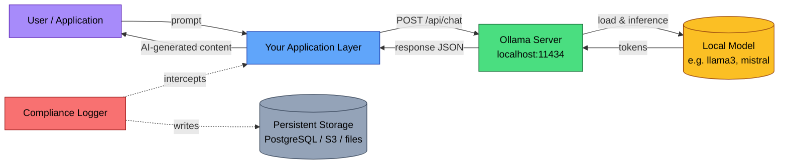

# EU AI Act Compliance Guide for Ollama Deployers

Self-hosted does not mean exempt. Running a model on your own hardware means you control the infrastructure, but if you deploy an AI system within the EU (or affecting EU residents), the EU AI Act applies to you. There is no cloud provider capturing traces, filing documentation, or managing transparency on your behalf. When you self-host, every compliance obligation is yours.

This guide maps Ollama's capabilities to EU AI Act requirements, identifies the gaps, and shows how to close them.

## Is your system in scope?

Articles 12, 13, and 14 of the EU AI Act apply only to **high-risk AI systems** as defined in Annex III. Most Ollama deployments (local chatbots, developer tools, content drafting, code completion) are not high-risk and are not subject to these obligations.

Your system is likely high-risk if it is used for:

| Annex III Category | Examples |
|--------------------|----------|
| 1. Biometrics | Remote biometric identification, emotion recognition, biometric categorisation by protected attributes |
| 2. Critical infrastructure | Safety components in water, gas, electricity, heating supply; road traffic management; digital infrastructure |
| 3. Education and vocational training | Admissions decisions, student assessment and grading, exam proctoring |
| 4. Employment | CV screening, candidate evaluation, task allocation, performance monitoring, promotion decisions |
| 5. Essential services | Credit scoring, insurance risk assessment, social benefit eligibility, emergency service dispatch prioritisation |
| 6. Law enforcement | Individual risk assessment, polygraph or similar tools, evidence analysis, profiling in criminal investigations |
| 7. Migration and border control | Asylum application assessment, entry screening, identification of irregular migration risks |
| 8. Administration of justice | Sentencing advisory tools, case law research influencing judicial decisions, dispute resolution |

If your use case does not fall under Annex III, the high-risk obligations (Articles 9-15) **do not apply via the Annex III pathway**, though risk classification is context-dependent. **Do not self-classify without legal review.**

Even if you are not high-risk, you may still have obligations under:
- **Article 50** (transparency): if users interact with AI-generated content
- **GDPR** (data protection): if prompts or responses contain personal data

These are your baseline. Read those sections below.

## How Ollama fits the regulatory picture

Ollama is a local inference server. You download a model, run `ollama serve`, and call it via REST API or client libraries. There is no intermediary cloud provider.

This simplifies some compliance questions and complicates others:

| Factor | Cloud LLM Provider | Ollama (Self-Hosted) |
|--------|--------------------|-----------------------|
| Who is the deployer? | You | You |
| Who is the provider? | The cloud vendor (OpenAI, Anthropic, etc.) | **You** (for Annex IV documentation and Article 13 transparency) |
| Cross-border data transfers? | Yes (usually US) | No (data stays on your hardware) |
| Built-in logging? | Usually yes (provider-side) | **Minimal** (server logs only; no request/response content logging) |
| Data Processing Agreements needed? | Yes, with each provider | No third-party DPA needed for inference |
| Who captures audit trails? | Shared responsibility | **Entirely you** |

The critical implication: when you self-host, you assume responsibilities that cloud providers normally share. You are both deployer and, in regulatory terms, the entity responsible for the system's documentation and operational logging.

## Data flow diagram



The data flow is simpler than cloud deployments: no cross-border transfers, no third-party processors at the inference layer. But GDPR still applies to the data flowing through the pipeline. If prompts contain names, emails, health information, or any personal data, you are processing personal data under GDPR regardless of where the server sits.

## Article 12: Record-keeping

Article 12 requires automatic event recording for the lifetime of high-risk AI systems. Ollama's built-in logging is designed for debugging, not compliance. Here is the gap analysis:

| Article 12 Requirement | Ollama Built-in | Status |
|------------------------|----------------|--------|
| Event timestamps | Server log timestamps | **Partial** (debug-level only) |
| Model version tracking | Model name in requests | **Available** (you must log it) |
| Input content (prompts) | Not logged by default | **Gap** |
| Output content (responses) | Not logged by default | **Gap** |
| Token consumption | Returned in API response (`eval_count`, `prompt_eval_count`) | **Available** (you must capture it) |
| Generation parameters (temperature, top_p, etc.) | Passed in request `options` | **Available** (you must log it) |
| Error recording | Server logs capture errors | **Partial** |
| Operation latency | `total_duration`, `load_duration`, `eval_duration` in response | **Available** (you must capture it) |
| User identification | Not tracked by Ollama | **Gap** |
| Data retention (6+ months) | No retention policy; logs rotate | **Gap** |

Ollama covers approximately 20-30% of Article 12 requirements with its default configuration. The server exposes useful metadata in API responses (token counts, durations), but **does not persist any of it**. Every field marked \"Available\" means the data exists in the response JSON but vanishes unless your application captures it.

### Ollama's logging reality

Ollama's server logs are operational, not compliance-grade:

- **macOS:** `~/.ollama/logs/server.log`
- **Linux:** `journalctl -u ollama` (systemd) or `~/.ollama/logs/server.log`
- **Windows:** `%LOCALAPPDATA%\\Ollama\\server.log`

Setting `OLLAMA_DEBUG=1` increases verbosity but still does not log prompt content or full response bodies. The `.ollama/history` directory records CLI interactions only, not API calls. This is the fundamental gap for compliance.

## Article 13: Transparency

When you self-host with Ollama, you are the entity responsible for transparency documentation. There is no provider handing you a model card or system description. You must produce:

1. **System description**: What the AI system does, its intended purpose, and its limitations
2. **Model documentation**: Which model(s) you run, their known capabilities and failure modes
3. **Input/output specification**: What data the system accepts and what it produces
4. **Performance metrics**: Accuracy, reliability, and any known biases relevant to your use case

Ollama gives you access to model metadata via the API:

```bash
# Get model details including parameters, template, and license
curl http://localhost:11434/api/show -d '{\"name\": \"llama3\"}'
```

```python
import ollama

# Retrieve model information for documentation
model_info = ollama.show('llama3')
# model_info contains: modelfile, parameters, template, details
# details includes: family, parameter_size, quantization_level
```

This is a starting point, not a finished document. You must supplement it with:
- Your specific use case description
- Input data types you actually process
- Any fine-tuning or system prompt modifications
- Known limitations for your deployment context

## Article 14: Human oversight

Article 14 requires high-risk AI systems to be designed so that natural persons can effectively oversee them. This means **human actors in the loop**: people who can interpret outputs, decide not to use them, and intervene or halt the system.

Automated controls (content filters, rate limiters, output validators) fall under Articles 9 (risk management) and 15 (accuracy/robustness). They are useful infrastructure, but they do not satisfy Article 14 on their own.

| Requirement | What it means | Ollama provides |
|-------------|---------------|-----------------|
| Human interpretation of outputs | A person reviews AI output before it affects decisions | Nothing; this is your application layer |
| Decision not to use output | A person can reject an AI recommendation | Nothing; this is your application layer |
| Intervention / halt | A person can stop the system mid-operation | `ollama stop <model>` or kill the server process |
| Escalation procedures | Flagged outputs route to human review | Nothing; you must build this |

Ollama is an inference server. It has no concept of review queues, approval workflows, or escalation logic. Every Article 14 obligation lives in your application layer.

Practical implementation for Ollama deployments:

```python
import ollama

def generate_with_oversight(prompt: str, model: str = 'llama3') -> dict:
    \"\"\"Generate a response with human oversight checkpoint.\"\"\"
    response = ollama.chat(
        model=model,
        messages=[{'role': 'user', 'content': prompt}]
    )

    result = {
        'model': model,
        'prompt': prompt,
        'response': response['message']['content'],
        'eval_count': response.get('eval_count', 0),
        'status': 'pending_review'  # Human must approve before downstream use
    }

    # In a high-risk system, this result goes to a review queue.
    # A human sets status to 'approved' or 'rejected' before
    # the output influences any decision.
    return result
```

The point: Ollama generates text. Your system decides what to do with it. Article 14 governs that decision layer.

## Article 50: User disclosure

Article 50 applies broadly, not just to high-risk systems. If your Ollama deployment generates content that users interact with, you have disclosure obligations.

**Article 50(1)**: If users interact directly with an AI system (chatbot, assistant), inform them they are interacting with AI, not a human. This must happen at the latest at the time of first interaction.

**Article 50(2)**: If the system generates synthetic text, audio, image, or video, outputs must be marked in a machine-readable format as AI-generated.

**Article 50(4)**: If the system generates deepfakes (manipulated image, audio, or video resembling real persons or events), deployers must disclose the artificial origin.

Implementation for Ollama deployments:

```python
import ollama
from datetime import datetime, timezone

DISCLOSURE_TEXT = (
    \"This response was generated by an AI system \"
    \"and has not been reviewed by a human.\"
)

AI_METADATA = {
    'ai_generated': True,
    'model': None,
    'timestamp': None,
    'disclosure': 'AI-generated content per EU AI Act Article 50'
}

def generate_with_disclosure(prompt: str, model: str = 'llama3') -> dict:
    \"\"\"Generate a response with Article 50 disclosure metadata.\"\"\"
    response = ollama.chat(
        model=model,
        messages=[{'role': 'user', 'content': prompt}]
    )

    return {
        'content': response['message']['content'],
        'metadata': {
            **AI_METADATA,
            'model': model,
            'timestamp': datetime.now(timezone.utc).isoformat()
        },
        'disclosure': DISCLOSURE_TEXT
    }
```

Your application layer must surface the disclosure to users. A hidden metadata field alone is not sufficient for Article 50(1); the user must see the disclosure.

## GDPR: Local processing is not a free pass

Self-hosting with Ollama eliminates cross-border data transfers at the inference layer. That removes a significant GDPR headache. But it does not eliminate data protection obligations.

If prompts or responses contain personal data, you must:

1. **Establish a legal basis** (GDPR Article 6): Consent, legitimate interest, or contractual necessity. Document which applies.
2. **Apply data minimization** (Article 5(1)(c)): Do not log more personal data than necessary for your compliance obligations.
3. **Define retention periods**: Compliance logging (Article 12) may require 6+ months of retention. GDPR requires you to delete personal data when no longer needed. These two requirements create tension; document your retention rationale.
4. **Honour data subject rights**: Right of access (Article 15), right to erasure (Article 17), right to rectification (Article 16). If someone's personal data is in your compliance logs, you must be able to find, export, and delete it.
5. **Conduct a DPIA** (Article 35): If your processing involves systematic, large-scale evaluation of personal aspects (profiling), a Data Protection Impact Assessment is likely required.

What Ollama's local architecture gives you:
- No third-party data processor at the inference layer (no DPA needed for the model provider)
- No cross-border transfer for inference (no Standard Contractual Clauses needed)
- Full control over data storage and deletion

What it does not give you:
- Automatic compliance with any GDPR article
- Data subject request handling
- Retention policy enforcement

## How to add compliant logging to Ollama

Ollama does not log request or response content. You must add this at your application layer. Here are three approaches, from simplest to most robust.

### Approach 1: Wrapper function (minimal)

Intercept every Ollama call and write structured logs.

```python
import json
import ollama
from datetime import datetime, timezone
from pathlib import Path
from uuid import uuid4

LOG_DIR = Path('./compliance-logs')
LOG_DIR.mkdir(exist_ok=True)

def log_interaction(
    request_id: str,
    model: str,
    messages: list,
    response: dict,
    user_id: str = 'anonymous',
    parameters: dict | None = None
) -> None:
    \"\"\"Write a single interaction to a compliance log file.\"\"\"
    record = {
        'request_id': request_id,
        'timestamp': datetime.now(timezone.utc).isoformat(),
        'model': model,
        'user_id': user_id,
        'messages': messages,
        'response_content': response['message']['content'],
        'token_usage': {
            'prompt_tokens': response.get('prompt_eval_count', 0),
            'completion_tokens': response.get('eval_count', 0),
        },
        'duration': {
            'total_ns': response.get('total_duration', 0),
            'load_ns': response.get('load_duration', 0),
            'eval_ns': response.get('eval_duration', 0),
        },
        'parameters': parameters or {},
        'ai_generated': True,
    }
    log_file = LOG_DIR / f\"{datetime.now(timezone.utc).strftime('%Y-%m-%d')}.jsonl\"
    with open(log_file, 'a') as f:
        f.write(json.dumps(record) + '\
')

def compliant_chat(
    model: str,
    messages: list,
    user_id: str = 'anonymous',
    **kwargs
) -> dict:
    \"\"\"Drop-in replacement for ollama.chat() with compliance logging.\"\"\"
    request_id = str(uuid4())

    response = ollama.chat(model=model, messages=messages, **kwargs)

    log_interaction(
        request_id=request_id,
        model=model,
        messages=messages,
        response=response,
        user_id=user_id,
        parameters=kwargs.get('options', {})
    )

    return response
```

Usage:

```python
# Before (no logging):
response = ollama.chat(model='llama3', messages=[{'role': 'user', 'content': 'Hello'}])

# After (compliant logging):
response = compliant_chat(
    model='llama3',
    messages=[{'role': 'user', 'content': 'Hello'}],
    user_id='analyst-042'
)
```

### Approach 2: Reverse proxy (captures all traffic)

Place a logging proxy between your application and Ollama. This captures every request regardless of which client library or language calls the API.

```python
\"\"\"
Compliance proxy for Ollama.
Run this instead of calling Ollama directly.
All requests to localhost:8080 are logged and forwarded to Ollama on :11434.
\"\"\"
from http.server import HTTPServer, BaseHTTPRequestHandler
import json
import urllib.request
from datetime import datetime, timezone
from pathlib import Path
from uuid import uuid4

OLLAMA_URL = 'http://localhost:11434'
LOG_DIR = Path('./compliance-logs')
LOG_DIR.mkdir(exist_ok=True)

class ComplianceProxy(BaseHTTPRequestHandler):
    def do_POST(self):
        content_length = int(self.headers.get('Content-Length', 0))
        request_body = self.rfile.read(content_length)
        request_data = json.loads(request_body) if request_body else {}

        # Force stream: false so we can capture the full response
        request_data['stream'] = False
        request_body = json.dumps(request_data).encode()

        req = urllib.request.Request(
            f\"{OLLAMA_URL}{self.path}\",
            data=request_body,
            headers={'Content-Type': 'application/json'},
            method='POST'
        )

        with urllib.request.urlopen(req) as resp:
            response_body = resp.read()
            response_data = json.loads(response_body)

        # Log the interaction
        record = {
            'request_id': str(uuid4()),
            'timestamp': datetime.now(timezone.utc).isoformat(),
            'endpoint': self.path,
            'request': request_data,
            'response': response_data,
            'ai_generated': True,
        }
        log_file = LOG_DIR / f\"{datetime.now(timezone.utc).strftime('%Y-%m-%d')}.jsonl\"
        with open(log_file, 'a') as f:
            f.write(json.dumps(record) + '\
')

        # Return response to client
        self.send_response(200)
        self.send_header('Content-Type', 'application/json')
        self.end_headers()
        self.wfile.write(response_body)

if __name__ == '__main__':
    server = HTTPServer(('localhost', 8080), ComplianceProxy)
    print('Compliance proxy running on :8080 -> forwarding to Ollama :11434')
    server.serve_forever()
```

Then point your application to `localhost:8080` instead of `localhost:11434`.

### Approach 3: REST API with structured logging

For production deployments, use the REST API directly with a structured logging library.

```python
import httpx
import structlog
from datetime import datetime, timezone
from uuid import uuid4

logger = structlog.get_logger('compliance')

OLLAMA_BASE = 'http://localhost:11434'

def chat_with_logging(
    model: str,
    messages: list[dict],
    user_id: str,
    options: dict | None = None
) -> dict:
    \"\"\"Call Ollama chat API with structured compliance logging.\"\"\"
    request_id = str(uuid4())
    timestamp = datetime.now(timezone.utc).isoformat()

    payload = {
        'model': model,
        'messages': messages,
        'stream': False,
        'options': options or {},
    }

    response = httpx.post(f'{OLLAMA_BASE}/api/chat', json=payload)
    response.raise_for_status()
    data = response.json()

    logger.info(
        'ollama_interaction',
        request_id=request_id,
        timestamp=timestamp,
        model=model,
        user_id=user_id,
        endpoint='/api/chat',
        prompt_tokens=data.get('prompt_eval_count', 0),
        completion_tokens=data.get('eval_count', 0),
        total_duration_ns=data.get('total_duration', 0),
        parameters=options or {},
        input_messages=messages,
        output_content=data.get('message', {}).get('content', ''),
        ai_generated=True,
    )

    return data
```

### Log schema reference

Whichever approach you use, ensure every record contains these fields for Article 12 compliance:

```json
{
  \"request_id\": \"uuid\",
  \"timestamp\": \"ISO 8601 UTC\",
  \"model\": \"model name and tag (e.g. llama3:8b-instruct-q4_0)\",
  \"user_id\": \"identifies the human or system that initiated the request\",
  \"endpoint\": \"/api/chat or /api/generate\",
  \"input\": \"full prompt or message array\",
  \"output\": \"full response content\",
  \"token_usage\": {
    \"prompt_tokens\": 0,
    \"completion_tokens\": 0
  },
  \"duration\": {
    \"total_ns\": 0,
    \"load_ns\": 0,
    \"eval_ns\": 0
  },
  \"parameters\": {
    \"temperature\": 0.7,
    \"top_p\": 0.9,
    \"top_k\": 40
  },
  \"ai_generated\": true
}
```

Retain these records for a minimum of **6 months** (Article 26(5) for deployers). If you are acting as a provider (distributing a fine-tuned model to others), retention extends to **10 years** (Article 18).

## Full compliance scan with AI Trace Auditor

Generate a compliance report for your Ollama deployment:

```bash
pip install ai-trace-auditor

# Scan your application code (not Ollama itself, but your code that calls Ollama)
aitrace comply ./your-ollama-app --split -o compliance/
```

This produces:
- `compliance/article-12-records.md` -- Record-keeping assessment
- `compliance/article-13-transparency.md` -- Transparency documentation gaps
- `compliance/data-flows.md` -- Data flow inventory

Generate a GDPR Article 30 Record of Processing Activities:

```bash
aitrace flow ./your-ollama-app -o data-flows.md
```

Check your application against Annex IV documentation requirements:

```bash
aitrace doc ./your-ollama-app -o annex-iv-docs.md
```

## Compliance checklist

Use this as a periodic audit checklist:

- [ ] **Scope determination**: Confirmed whether your use case falls under Annex III (with legal review)
- [ ] **Logging**: Every Ollama API call is logged with full request/response content, timestamps, model ID, user ID, and token counts
- [ ] **Retention**: Logs stored for 6+ months in persistent storage (not just local files that rotate)
- [ ] **Transparency documentation**: System description, model card, intended purpose, and limitations documented
- [ ] **User disclosure**: Users are informed they interact with AI at first interaction (Article 50)
- [ ] **AI-generated marking**: Outputs include machine-readable metadata indicating AI generation (Article 50)
- [ ] **Human oversight**: Review queue or approval workflow exists for high-risk decisions (Article 14)
- [ ] **Escalation procedure**: Process defined for routing flagged outputs to human review
- [ ] **GDPR legal basis**: Documented legal basis for processing personal data in prompts
- [ ] **Data subject rights**: Ability to find, export, and delete personal data in compliance logs
- [ ] **Retention schedule**: Defined and enforced retention periods balancing Article 12 and GDPR minimization
- [ ] **DPIA**: Data Protection Impact Assessment completed if processing involves profiling or large-scale personal data

## Resources

- [EU AI Act full text](https://artificialintelligenceact.eu/)
- [Annex III: High-risk AI systems](https://artificialintelligenceact.eu/annex/3/)
- [Article 50: Transparency obligations](https://artificialintelligenceact.eu/article/50/)
- [Ollama API documentation](https://github.com/ollama/ollama/blob/main/docs/api.md)
- [Ollama Python library](https://github.com/ollama/ollama-python)
- [Ollama troubleshooting (log locations)](https://docs.ollama.com/troubleshooting)
- [AI Trace Auditor](https://github.com/BipinRimal314/ai-trace-auditor) -- open-source compliance scanning

---

*This guide was produced with assistance from [AI Trace Auditor](https://github.com/BipinRimal314/ai-trace-auditor) and reviewed for accuracy. It is not legal advice. The EU AI Act's compliance deadlines are staggered through 2027. Consult a qualified legal professional for compliance decisions specific to your deployment.*
