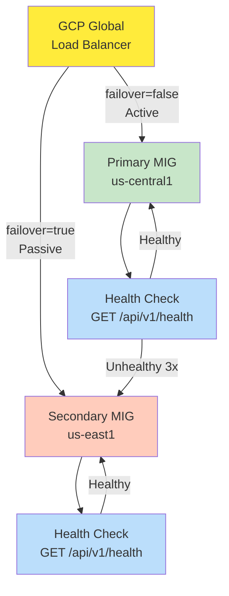

# Automated Failover

Multi-region active-passive failover for 99.99% uptime.

## Overview

Ollama uses GCP Global HTTP(S) Load Balancer to provide automatic failover between regions.

- **Primary Region**: us-central1 (active)
- **Secondary Region**: us-east1 (passive)
- **Failover Trigger**: 3 consecutive health check failures
- **Failover Time**: < 30 seconds
- **Health Check Interval**: 10 seconds

## Architecture



## Failover Policy

Health check monitors `/api/v1/health` endpoint:

- **Interval**: 10 seconds
- **Timeout**: 5 seconds
- **Healthy Threshold**: 2 consecutive successes
- **Unhealthy Threshold**: 3 consecutive failures

When primary becomes unhealthy:

1. Health check fails (failure #1)
2. Health check fails (failure #2)
3. Health check fails (failure #3) → **Failover triggered**
4. Load Balancer redirects all traffic to secondary
5. Secondary serves 100% of traffic
6. Primary region monitored for recovery

Failover duration: 30-40 seconds (interval × unhealthy threshold)

## Deployment

### Prerequisites

- 2 regional Managed Instance Groups (MIGs) deployed
- Each MIG with ≥1 healthy instance running Ollama API
- Instance groups in regions: us-central1 and us-east1
- SSL certificates provisioned

### Deploy Failover

```bash
# 1. Fill in tfvars
cp docker/terraform/failover.auto.tfvars.example \
   docker/terraform/failover.auto.tfvars

# Edit with actual values:
# - project_id: Your GCP project
# - primary_instance_group: Self-link for primary MIG
# - secondary_instance_group: Self-link for secondary MIG

# 2. Apply Terraform
cd docker/terraform
terraform init
terraform plan -var enable_failover=true
terraform apply -auto-approve -var enable_failover=true

# 3. Verify resources created
gcloud compute backend-services describe prod-ollama-api-backend
```

## Verification

### Health Check Status

```bash
gcloud compute backend-services get-health prod-ollama-api-backend
```

Expected output:

```
healthStatus:
- healthyInstances: 3
  instance: zones/us-central1-a/instances/ollama-1
  ipAddress: 10.0.0.1
  port: 8000

- healthyInstances: 3
  instance: zones/us-east1-b/instances/ollama-2
  ipAddress: 10.1.0.1
  port: 8000
```

### Test Failover

```bash
# 1. Stop primary region
gcloud compute instance-groups managed set-autoscaling \
  primary-ollama-api \
  --region us-central1 \
  --min-num-replicas 0 \
  --max-num-replicas 0

# 2. Wait 30 seconds

# 3. Verify traffic served by secondary
curl https://elevatediq.ai/ollama/api/v1/health

# 4. Check logs
gcloud logging read "resource.type=http_load_balancer AND jsonPayload.backend_service_name=prod-ollama-api-backend"

# 5. Restore primary
gcloud compute instance-groups managed set-autoscaling \
  primary-ollama-api \
  --region us-central1 \
  --min-num-replicas 1 \
  --max-num-replicas 3
```

## Monitoring

### Key Metrics

- Backend health status: Primary/Secondary healthy count
- Failover events: Triggered count, duration
- Request latency: P50, P95, P99 by region
- Error rate: 5xx, 4xx by backend

### Dashboard

Access in GCP Console:

```
Load Balancing > prod-ollama-api-lb > Monitoring
```

### Alerts

Configure alerts:

```yaml
- condition: Backend health < 1
  notification: PagerDuty
  severity: Critical

- condition: Failover event triggered
  notification: Slack, PagerDuty
  severity: High
```

## Backout

If issues arise:

```bash
# Disable failover
terraform apply -auto-approve -var enable_failover=false

# Verify primary is active
gcloud compute backend-services get-health prod-ollama-api-backend

# Monitor logs
gcloud logging read "resource.type=http_load_balancer" \
  --limit 100 \
  --format json | jq '.[] | select(.jsonPayload.status_code == "500")'
```

## Expected Uptime

With failover:

| Scenario            | Uptime                    | Improvement         |
| ------------------- | ------------------------- | ------------------- |
| Single region       | 99.9% (43m/month)         | -                   |
| With failover       | 99.99% (4.3m/month)       | 10x improvement     |
| Planned maintenance | N/A (use circuit breaker) | Both regions rotate |

See [Monitoring Guide](../operations/monitoring.md) for observability setup.
