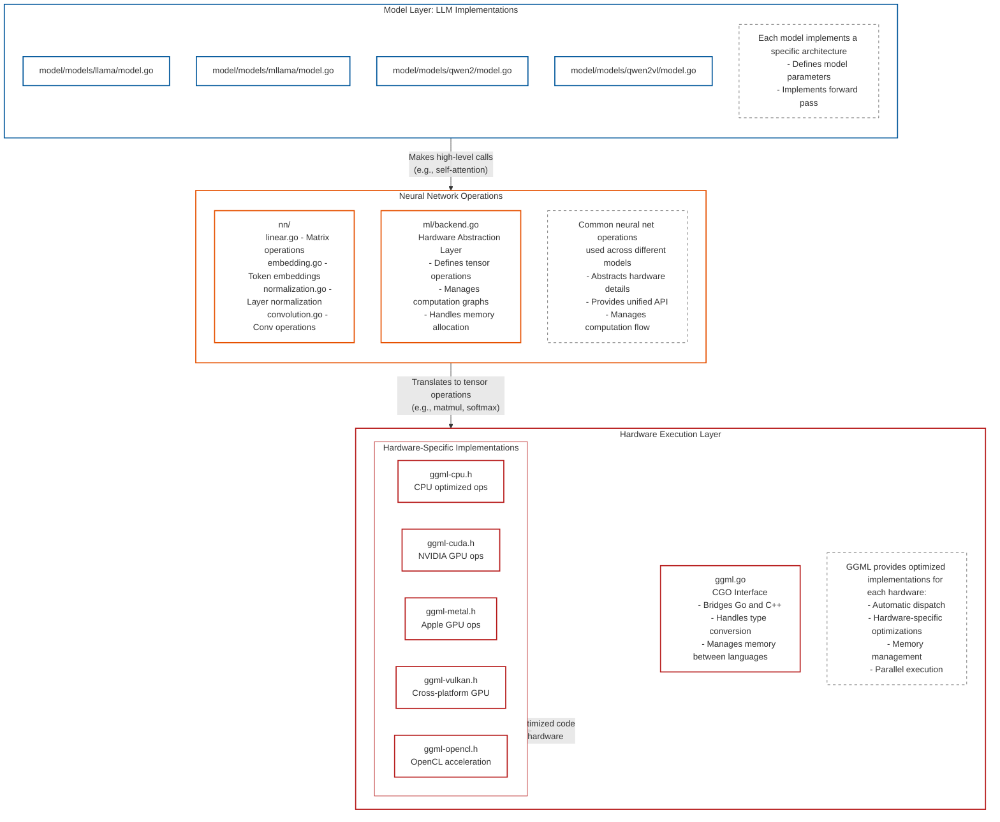

# Guide: Implementing Models in Ollama's Go Inference Engine

> **Note**: This guide and the Go inference engine are in early development and will be updated as implementation details evolve.

This guide outlines the process of implementing a new model in Ollama's inference engine. It covers everything from initial setup to deploying your model to ollama.com.

## Architecture Overview

Below is a diagram showing Ollama's inference engine architecture layers and how they interact:



When implementing a new model, you'll primarily work in the model layer, interfacing with the neural network operations layer.

## Implementation Steps

### 1. Environment Setup

First, clone the Ollama repository and get it running locally. Follow the development setup guide at:
https://github.com/ollama/ollama/blob/main/docs/development.md

### 2. Research Implementation

Get the original model implementation running. This typically involves:
- Cloning the research code repository (usually Python-based)
- Setting up the required environment
- Running inference with sample inputs
- Understanding the model architecture and forward pass

### 3. Project Structure Setup

Create the necessary file structure by referencing previous model implementations. You'll need:

```
model/
└── your-model/
    ├── model.go         # Architecture and forward pass implementation
    ├── convert.go       # Weight conversion logic (PyTorch/SafeTensors to GGML)
    └── convert_test.go  # Conversion logic tests
```

Add your model to the main paths in [model/models/models.go](https://github.com/ollama/ollama/blob/main/model/models/models.go):

```
package models

import (
    _ "github.com/ollama/ollama/model/models/llama"
    _ "github.com/ollama/ollama/model/models/mllama"
    _ "github.com/ollama/ollama/model/models/your-model"  // Add your model here
)
```

### 4. Development Process

1. **Open a Draft PR**
   - Create a draft pull request in the `ollama/ollama` repository
   - Use this as a communication channel with Ollama maintainers

2. **Implement Weight Conversion**
   - Work on `convert.go`
   - Reference existing conversion implementations
   - Create a basic Modelfile:
     ```
     FROM /path/to/model
     ```
   - Test conversion:
     ```bash
     go run . create <my-model> -f /path/to/Modelfile
     ```

3. **Implement Model Logic**
   - Implement `New()` and `Forward()` functions in `model.go`
   - Reference existing model implementations
   - Debug forward pass:
     ```bash
     OLLAMA_DEBUG=1 go run . run <my-model>
     ```
   - Compare output with research implementation

4. **Tokenizer Implementation**
   - Implement a new tokenizer if required
   - Ensure compatibility with model architecture

5. **Text Generation Testing**
   - Implement proper prompt formatting
   - Test basic generation:
     ```bash
     go run . run <my-model> "hello"
     ```

### 5. Testing

1. Add comprehensive tests to:
   - `model_test.go`
   - `convert_test.go`

2. Ensure tests cover:
   - Weight conversion
   - Model initialization
   - Text generation

### 6. Model Deployment

1. **Finalize Pull Request**
   - Move PR out of draft state
   - Address reviewer feedback

2. **Deploy to ollama.com**
   - Determine model prompt format
   - Convert prompt format to Go template
   - Create final Modelfile:
     ```
     FROM <converted-gguf>
     TEMPLATE <prompt-template>
     LICENSE <license-info>
     # Add additional parameters if needed
     ```
   - Push to ollama.com:
     ```bash
     ollama create <your-namespace>/<your-model> -f /path/to/Modelfile
     ollama push <your-namespace>/<your-model>
     ```

3. **Integration Testing**
   - Run end-to-end tests
   - Verify model behavior in production environment
