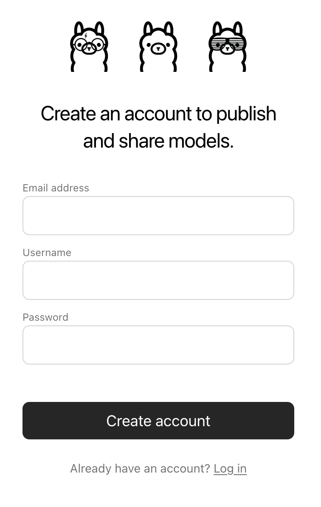
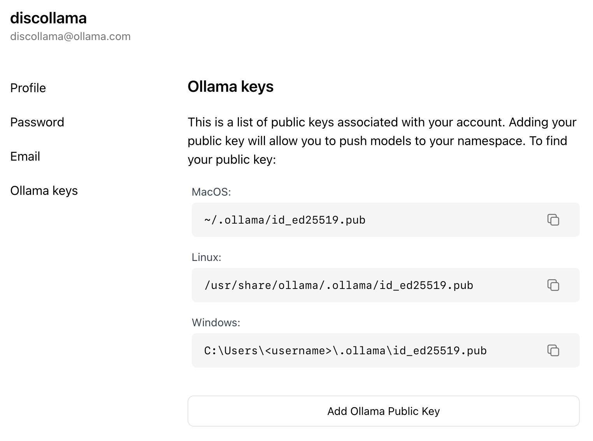

## Table of Contents

- [Importing an adapter](#importing-a-fine-tuned-adapter)
- [Importing a Safetensors model](#importing-a-model-from-safetensors-weights)
- [Importing a GGUF file](#importing-a-gguf-based-model-or-adapter)
- [Quantizing a GGUF model](#quantizing-a-gguf-model)
- [Sharing models on ollama.com](#sharing-your-model-on-ollama-com)

## Importing a fine tuned adapter

First, create a `Modelfile` with a `FROM` command pointing at the base model you used for fine tuning, and an `ADAPTER` command which points to your GGUF adapter:

```dockerfile
FROM <base model name>
ADAPTER /path/to/adapter.gguf
```

Make sure that you use the same base model in the `FROM` command as you used to create the adapter otherwise you will get erratic results. Most frameworks use different quantization methods, so it's best to use non-quantized (i.e. non-QLoRA) adapters. If your adapter is in the same directory as your `Modelfile`, use `ADAPTER .` to specify the adapter path.

Now run `ollama create` from the directory where the `Modelfile` was created:

```shell
ollama create my-model
```

Lastly, test the model:

```shell
ollama run my-model
```

Ollama supports importing adapters based on several different model architectures including:

- Llama (including Llama 2, Llama 3, Llama 3.1, and Llama 3.2);
- Mistral (including Mistral 1, Mistral 2, and Mixtral); and
- Gemma (including Gemma 1 and Gemma 2)

Safetensors adapters must be converted to GGUF before importing. Use `convert_lora_to_gguf.py` from [llama.cpp](https://github.com/ggml-org/llama.cpp), then reference the converted GGUF adapter from `ADAPTER`.

You can create the source adapter using a fine tuning framework or tool such as the Hugging Face [fine tuning framework](https://huggingface.co/docs/transformers/en/training), [Unsloth](https://github.com/unslothai/unsloth), or [MLX](https://github.com/ml-explore/mlx).

## Importing a model from Safetensors weights

First, create a `Modelfile` with a `FROM` command which points to the directory containing your Safetensors weights:

```dockerfile
FROM /path/to/safetensors/directory
```

If you create the Modelfile in the same directory as the weights, you can use the command `FROM .`.

Now run the `ollama create` command from the directory where you created the `Modelfile`:

```shell
ollama create my-model
```

Lastly, test the model:

```shell
ollama run my-model
```

## Importing a GGUF file

To import a GGUF model, create a `Modelfile` containing:

```dockerfile
FROM /path/to/file.gguf
```

Once you have created your `Modelfile`, use the `ollama create` command to build the model.

```shell
ollama create my-model
```

## Sharing your model on ollama.com

You can share any model you have created by pushing it to [ollama.com](https://ollama.com) so that other users can try it out.

First, use your browser to go to the [Ollama Sign-Up](https://ollama.com/signup) page. If you already have an account, you can skip this step.



The `Username` field will be used as part of your model's name (e.g. `jmorganca/mymodel`), so make sure you are comfortable with the username that you have selected.

Now that you have created an account and are signed-in, go to the [Ollama Keys Settings](https://ollama.com/settings/keys) page.

Follow the directions on the page to determine where your Ollama Public Key is located.



Click on the `Add Ollama Public Key` button, and copy and paste the contents of your Ollama Public Key into the text field.

To push a model to [ollama.com](https://ollama.com), first make sure that it is named correctly with your username. You may have to use the `ollama cp` command to copy
your model to give it the correct name. Once you're happy with your model's name, use the `ollama push` command to push it to [ollama.com](https://ollama.com).

```shell
ollama cp mymodel myuser/mymodel
ollama push myuser/mymodel
```

Once your model has been pushed, other users can pull and run it by using the command:

```shell
ollama run myuser/mymodel
```
