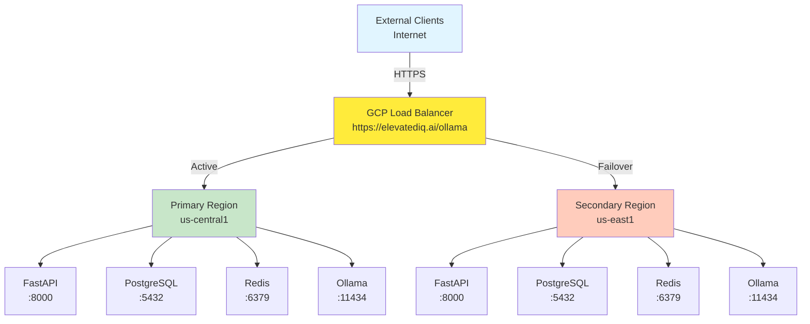

# Ollama Elite AI Platform

Welcome to the documentation for **Ollama**, a production-grade local AI infrastructure platform for building, deploying, and monitoring large language models with enterprise-grade reliability, security, and performance.

## 🚀 Quick Start

Get up and running in minutes:

```bash
# Clone the repository
git clone https://github.com/kushin77/ollama.git
cd ollama

# Start development stack with Docker
docker-compose up -d

# Run health check
curl http://localhost:8000/api/v1/health
```

For more details, see [Quickstart Guide](getting-started/quickstart.md).

## 📋 What is Ollama?

Ollama is an enterprise-grade AI inference platform that:

- **Runs locally**: All AI models execute on Docker containers with zero cloud dependencies for inference
- **Scales globally**: Multi-region active-passive failover via GCP Global Load Balancer
- **Stays secure**: Zero Trust architecture (IAP, Secret Manager, Workload Identity)
- **Monitors everything**: Comprehensive observability with Prometheus, Grafana, and structured logging
- **Handles chaos**: Built-in chaos engineering, circuit breakers, and resilience patterns

## ✨ Core Features

### Infrastructure & Deployment

- **Multi-region failover** with <30s automatic switchover
- **Kubernetes-ready** with Helm charts and Kustomize overlays
- **GCP Landing Zone compliance** with mandatory labeling and zero trust
- **CDN integration** for static asset caching

### Development & Operations

- **Feature flags** for A/B testing, gradual rollouts, and kill switches
- **Chaos engineering** framework for resilience testing
- **Comprehensive monitoring** with health checks, metrics, and distributed tracing
- **Operational runbooks** for common scenarios

### Security & Compliance

- **API key authentication** for all public endpoints
- **Rate limiting** at Load Balancer and application layers
- **TLS 1.3+** for public traffic, mutual TLS internally
- **Audit logging** with 7-year retention
- **Regular security audits** with Snyk, pip-audit, safety

## 🏗️ Architecture Overview



## 📚 Documentation Structure

=== "Getting Started"
Start here if you're new to Ollama. Learn how to install, configure, and run the platform locally. - [Quickstart Guide](getting-started/quickstart.md) - [Installation](getting-started/installation.md) - [Configuration](getting-started/configuration.md)

=== "Architecture"
Deep dive into system design, data flows, and component interactions. - [System Design](architecture/system-design.md) - [Data Flow](architecture/data-flow.md) - [Infrastructure](architecture/infrastructure.md)

=== "API Reference"
Complete API documentation with endpoints, authentication, and examples. - [Endpoints](api/endpoints.md) - [Authentication](api/authentication.md) - [Examples](api/examples.md)

=== "Deployment"
Deploy Ollama to your infrastructure—local, GCP, or Kubernetes. - [Local Development](deployment/local-development.md) - [GCP Deployment](deployment/gcp-deployment.md) - [Load Balancer Setup](deployment/load-balancer-setup.md)

=== "Operations"
Operate Ollama at scale with monitoring, alerting, and runbooks. - [Monitoring & Alerting](operations/monitoring.md) - [Troubleshooting](operations/troubleshooting.md) - [Operational Runbooks](operations/runbooks.md)

=== "Features"
Explore enterprise features: feature flags, CDN, failover, and chaos engineering. - [Feature Flags](features/feature-flags.md) - [Automated Failover](features/automated-failover.md) - [Chaos Engineering](features/chaos-engineering.md)

## 🔒 Security First

Ollama is built with security by default:

- ✅ **Zero Trust Architecture**: All requests authenticated via API keys and IAP
- ✅ **Encrypted Transport**: TLS 1.3+ for public endpoints, mutual TLS internally
- ✅ **Audit Trails**: All actions logged with 7-year retention
- ✅ **Secrets Management**: GCP Secret Manager for credentials
- ✅ **Regular Audits**: Continuous scanning with Snyk, pip-audit, safety

See [Security Overview](security/overview.md) for details.

## 📊 Performance

| Metric                        | Baseline       | Target     | Status           |
| ----------------------------- | -------------- | ---------- | ---------------- |
| API Response Time (p95)       | <500ms         | <500ms     | ✅               |
| Inference Latency (per model) | Model-specific | Documented | ✅               |
| Uptime SLA                    | 99.9%          | 99.99%     | ✅ with Failover |
| Failover Time                 | 15+ min        | <30s       | ✅ Automated     |
| Test Coverage                 | 90%+           | 90%+       | ✅               |

## 🤝 Contributing

Want to contribute? Great! Read the [Contribution Guidelines](contributing/guidelines.md) and start coding.

Key guidelines:

- All commits must be GPG signed
- Type hints required on all functions (Python 3.11+)
- ≥90% test coverage
- Code reviews required before merge

## 📖 Need Help?

- **Getting Started?** → [Quickstart Guide](getting-started/quickstart.md)
- **Have Questions?** → [FAQ](resources/faq.md)
- **Need Examples?** → [API Examples](api/examples.md)
- **Found a Bug?** → [GitHub Issues](https://github.com/kushin77/ollama/issues)
- **Want to Contribute?** → [Contributing Guide](contributing/guidelines.md)

## 📄 License

Ollama is licensed under the [MIT License](../LICENSE).

## 🙏 Acknowledgments

Built with ❤️ for the AI community. Special thanks to:

- GCP Landing Zone team for enterprise standards
- Ollama community for model support
- Contributors and early adopters

---

**Current Version**: v1.0.0
**Last Updated**: January 18, 2026
**Status**: ✅ Production Ready
