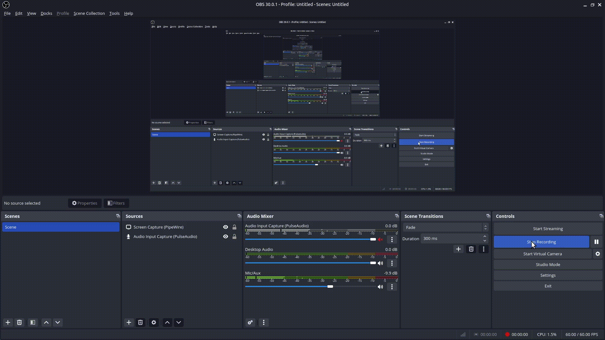

# golang-steamchat

This is a simple golang code to stream response from llama2.

## Get Started

1. Run the Ollama Docker container:

```shell
sudo docker run -d -v ollama:/root/.ollama -p 11434:11434 --name ollama ollama/ollama
```

For more detailed information, refer to the [Ollama Quickstart Docker](https://hub.docker.com/r/ollama/ollama). Please note we are using CPU only, the AI will response slow, if you have GPU, you can follow the instruction to run the docker and using your GPU to improve performance.

2. Pull the llama2 model:

```shell
curl --location 'http://localhost:11434/api/pull' \
--header 'Content-Type: application/json' \
--data '{
    "name": "llama2:7b"
}'
```

3. Run the golang code.

```shell
go run main.go
```


