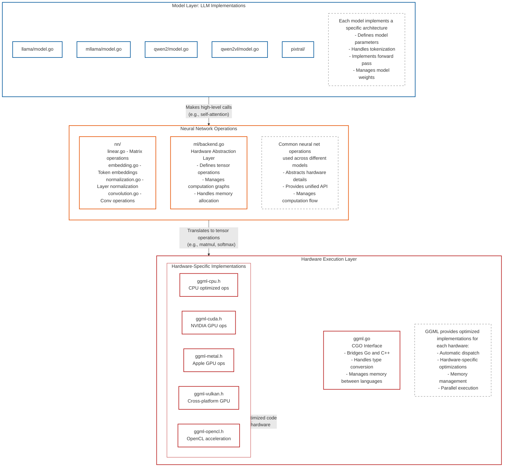

# Ollama Models

!! This is a work in progress document !!

## Architecture



## Adding support for a new model to Ollama

1. Clone the Ollama repo and get it running locally: https://github.com/ollama/ollama/blob/main/docs/development.md
2. Get the original model (research code) running locally. This will 99.99% of the time be a Python repository.
3. Get a dump of the graph built with Pytorch or Safetensors. Use this snippet to do so.
```python
import torch
import sys
from safetensors.torch import load_file

def extract_graph(model_path):
    if model_path.endswith('.safetensors'):
        state_dict = load_file(model_path)
    else:
        state_dict = torch.load(model_path, weights_only=True)
    
    graph = []
    for name, tensor in state_dict.items():
        if isinstance(tensor, torch.Tensor):
            graph.append({
                "name": name,
                "shape": list(tensor.shape)
            })
    
    print("{")
    print('    "graph": [')
    for i, layer in enumerate(graph):
        comma = "," if i < len(graph) - 1 else ""
        print(f'        {{"name": "{layer["name"]}", "shape": {layer["shape"]}}}{comma}')
    print("    ]")
    print("}")

if __name__ == "__main__":
    if len(sys.argv) != 2:
        print("Usage: python extract.py <path/to/model>")
        sys.exit(1)
    
    extract_graph(sys.argv[1])
``` 
4. Look at a previous model implementation pull request and copy the structure of the files needed. We will need:
    1. A `model/<model-name>`  directory
    2. A `model/<model-name>/model.go`  file to implement the architecture and forward pass.
    3. A `model/<model-name>/convert.go`  file to implement to conversion from pytorch/safetensors to ggml.
    4. `model/<model-name>/model_test.go`  and `model/<model-name>/convert_test.go` files for testing.
    5. Modify main paths to make this new model accessible.
5. Open a draft pull request in the `ollama/ollama` repo, as a place to ask questions and get answers from Ollama maintainers.
6. Implement conversion from the model weights (pytorch, safetensors) to ggml in the `model/<your-model>/convert.go`  file. Reference other `convert.go` files. 
7. Create a Modelfile that only references the pytorch/safetensor directory. We will handle the other fields later.
Modelfile:
```
FROM /path/to/model
```
Use `ollama create` to convert the model:
`go run . create <my-model> -f /path/to/Modelfie`
6. Implement the `New()` and `Forward()` logic in `model/<your-model>/model.go` . Reference other `model.go` files. 

Run the model and get the debug output of the forward pass to compare with the output of the research implementation from step 1: 
`OLLAMA_DEBUG=1 go run . run <my-model>` 
7. (maybe) Implement a new tokenizer, if needed.
8. Test text generation, this step requires knowing the prompt format:
`go run . run <my-model> "hello"`  
9. Add tests to `model/<your-model>/model_test.go`  and `model/<your-model>/convert_test.go` 
10. Push changes to `ollama/ollama` pull request, and move the pull request out of the draft state.
11. Push model to ollama.com:
    1. Find model prompt format and convert it to a Go template.
    2. Create a Modelfile `FROM` the converted gguf, add the `TEMPLATE`, `LICENSE`, and parameters if needed.
    3. `ollama create <your-namespace>/<your-model> -f /path/to/Modelfile`
    4. `ollama push <your-namespace>/<your-model>`
12. Run end-to-end integration tests.
